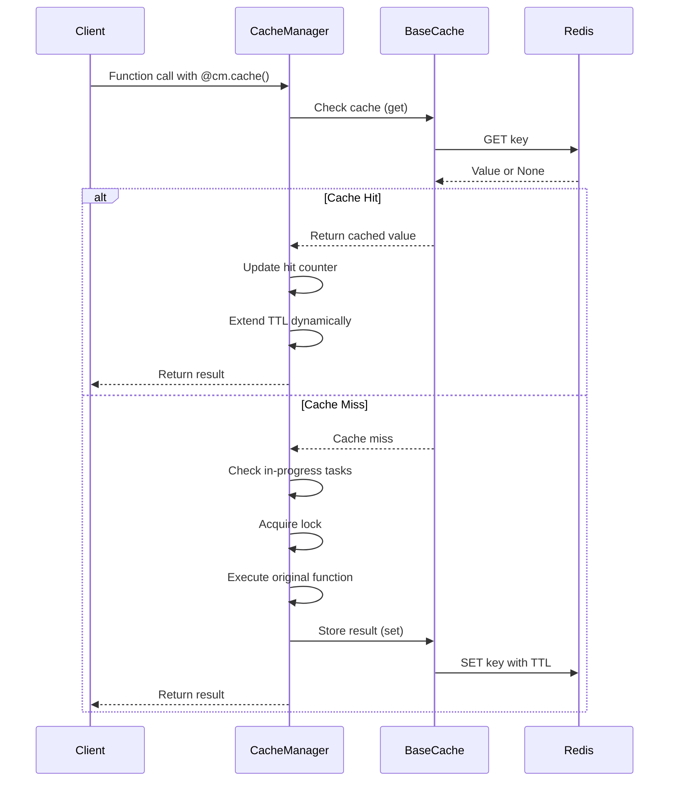
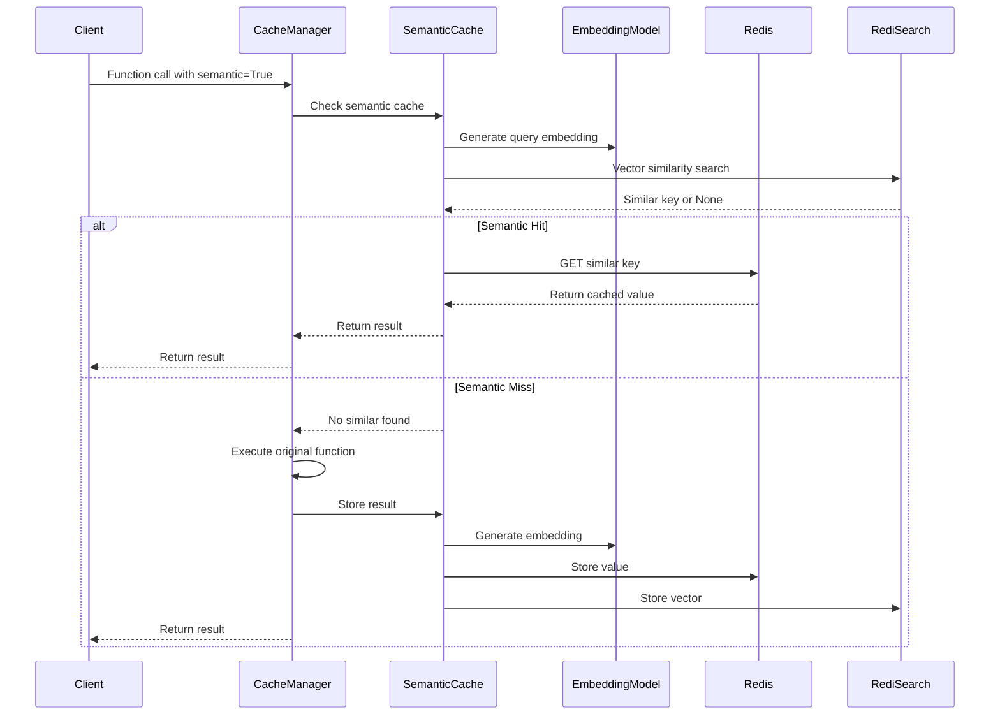

# VIE (Video Insight Engine) - Redis Cache System Architecture

---
## Overview

The VIE Redis Cache System is a comprehensive caching solution designed for the Video Insight Engine project. It provides both traditional key-value caching and advanced semantic similarity-based caching capabilities, supporting both synchronous and asynchronous operations with Redis Cluster and Master-Slave replication configurations.

---
## System Architecture Diagram



---

## 📁 Project Structure

```
cache_manager/
├── base_cache.py               # Redis client wrapper with sync/async support
├── cache_manager.py            # Core logic for function caching and management
├── cache_manager_dist_lock.py  # CacheManager variant using Redis-based distributed locks
├── distributed_lock.py         # Redis distributed lock implementations (sync/async)
├── semantic_redis_cache.py     # Semantic similarity-based caching implementation
├── utils.py                    # Utility functions like hash_query
└── __init__.py                 # Package initialization
```

---

## 🔧 Features

- ✅ Decorator-based caching for any function
- ✅ Supports both synchronous and asynchronous functions
- ✅ Auto TTL adjustment based on popularity (`(hit_counter * multiplier + 1) * default_ttl`)
- ✅ Prevents cache breakdown using in-progress task tracking and locks
- ✅ Clear specific caches by name or by passing the decorated function
- ✅ Supports Redis Cluster and standalone Redis
- ✅ Auto cleanup of expired locks and counters
- ✅ Distributed Lock Support for multi-instance coordination

### 🧠 Semantic Caching Add-ons

- ✅ BAAI/bge-m3 model integration for semantic similarity matching
- ✅ Vector index management via RediSearch
- ✅ Hybrid key generation: combines traditional hashing with semantic vector search
- ✅ Configurable similarity threshold (default 0.8)

---

## 📦 Installation

```bash
pip install -r requirements.txt
```

---

## 🧩 Usage Example

### 1. Initialize CacheManager

```python
from cache_manager import CacheManager

cm = CacheManager(
    host="localhost",
    port=6379,
    db=0,
    password=None,
    max_connections=100,
    ttl=3600,               # Default TTL
    ttl_multiplier=0.1,     # Extend TTL dynamically based on popularity
    is_cluster=False,
    cleanup_interval=3600   # Clean up expired locks every hour
)
```

### 2. Use the `@cm.cache()` Decorator

You can use the `@cm.cache()` decorator to easily enable caching for any function — both **synchronous** and **asynchronous**.

### ✅ Automatic Cache Name (No Arguments)

If you simply use `@cm.cache` without specifying a name:

```python
@cm.cache
def get_user_info(user_id: int) -> dict:
    print(f"[DB] Fetching user {user_id}")
    return {
        "id": user_id,
        "name": f"User {user_id}",
        "email": f"user{user_id}@example.com"
    }
```

The cache manager will automatically generate a name based on:

```python
f"{func.__module__}.{func.__qualname__}"
```

This ensures that each decorated function gets its own isolated cache space.

> 🔍 Example generated name:
> `__main__.get_user_info` or `my_module.users.get_user_info`

### 🧩 Custom Cache Name

You can also specify a custom name explicitly:

```python
@cm.cache("user_profile")
def get_user_info(user_id: int) -> dict:
    ...
```

This is useful if you want to group multiple functions under the same cache name or make it easier to reference later (e.g., for clearing).

### 🔄 Supported Usage

#### ✅ Synchronous Function Example

```python
@cm.cache("get_user_info")
def get_user_info(user_id: int) -> dict:
    print(f"[DB] Fetching user {user_id}")
    return {
        "id": user_id,
        "name": f"User {user_id}",
        "email": f"user{user_id}@example.com"
    }

print(get_user_info(123))  # First call (no cache)
print(get_user_info(123))  # From cache
```

#### ✅ Asynchronous Function Example

```python
import asyncio

@cm.cache("async_get_data")
async def async_get_data(query: str) -> str:
    print(f"[ASYNC DB] Fetching data for '{query}'")
    await asyncio.sleep(1)
    return f"Result for '{query}'"

async def main():
    print(await async_get_data("test"))  # First call
    print(await async_get_data("test"))  # From cache

await main()
```

---

## 🔍 Semantic Caching Usage

To enable semantic caching, add `semantic=True` to your decorator:

```python
@cm.cache(semantic=True)
def search_products(query: str) -> List[Product]:
    print(f"[DB] Searching for products matching '{query}'")
    # Your actual database query logic here
    ...

# These similar queries will hit the same cache entry
search_products("red shoes size 9")
search_products("shoes red color size nine")
```

> ⚠️ **Important**: When using semantic caching, the decorated function must have a `query` parameter (either as a positional argument or keyword argument). This is used to extract the text for semantic similarity comparison.

You can also specify a custom name and similarity threshold:

```python
@cm.cache("product_search", semantic=True, similarity_threshold=0.85)
def search_products(query: str) -> List[Product]:
    ...
```

---

## ⚙️ Distributed Lock Support

### 🔐 `CacheManagerDistLock` — Redis-based Distributed Locking

For multi-instance or containerized deployments, use **`CacheManagerDistLock`**, which employs **Redis distributed locks** to coordinate cache operations across nodes.

```python
from cache_manager import CacheManagerDistLock

cmdl = CacheManagerDistLock(
    host="localhost",
    port=6379,
    ttl=3600,
)
```

* Internally uses **`RedisLock`**/**`AsyncRedisLock`** (from `distributed_lock.py`).
* Ensures that only **one instance** recomputes a missing cache entry at a time.
* Prevents **cache breakdown** even across distributed environments.
* API usage is **identical to `CacheManager`**, so existing decorators work seamlessly.

```python
@cmdl.cache("user_profile")
async def fetch_user(user_id: int):
    ...
```

---

## ⚙️ Configuration Options

| Parameter                | Default         | Description                               |
| ------------------------ | --------------- | ----------------------------------------- |
| `host`                 | `"localhost"` | Redis server host                         |
| `port`                 | `6379`        | Redis server port                         |
| `db`                   | `0`           | Redis database index                      |
| `password`             | `None`        | Redis authentication password             |
| `max_connections`      | `100`         | Max connections in pool                   |
| `ttl`                  | `3600`        | Default time-to-live in seconds           |
| `ttl_multiplier`       | `0.1`         | Multiplier for dynamic TTL extension      |
| `is_cluster`           | `False`       | Whether to use Redis Cluster              |
| `cleanup_interval`     | `3600`        | Interval (seconds) for background cleanup |
| `semantic`             | `False`       | Enable semantic caching                   |
| `embedding_model`           | `"BAAI/bge-m3"` | SentenceTransformer or Ollama model name            |
| `ollama_url`           | `None`        | Ollama server URL (If None, SentenceTransformer will be used)                         |
| `similarity_threshold` | `0.8`         | Minimum similarity score for match (0-1)  |

---

## 🔄 Data Flow Summary
### 1. Standard Cache Flow



### 2. Semantic Cache Flow



---

## 🗑️ How Cache Keys Are Generated

Each cache key is generated using SHA256 hashing of the name (module name + function name) + arguments:

```python
key = f"{name}:{hash_query(key_data)}"
```

Where `hash_query` uses `pickle.dumps(data)` before hashing.

For semantic caching, vector embeddings are stored in a separate namespace with prefix `sem_cache:` and managed through RediSearch vector indexes.

---

## Future Enhancements

### Planned Features

* [ ] **Cache Warming**: Pre-populate frequently accessed data
* [ ] **Cache Analytics**: Advanced hit rate and performance analytics
* [ ] **Multi-tier Caching**: L1 (memory) + L2 (Redis) caching
* [ ] **Cache Invalidation**: Smart invalidation strategies
* [x] **Distributed Locking**: Enhanced concurrency control (implemented in `distributed_lock.py`)

### Integration Opportunities

* [ ] **Message Queues**: Redis Streams for async processing
* [ ] **Search Integration**: Enhanced semantic search capabilities
* [ ] **ML Pipeline**: Integration with ML model caching
* [ ] **API Gateway**: Centralized caching for microservices