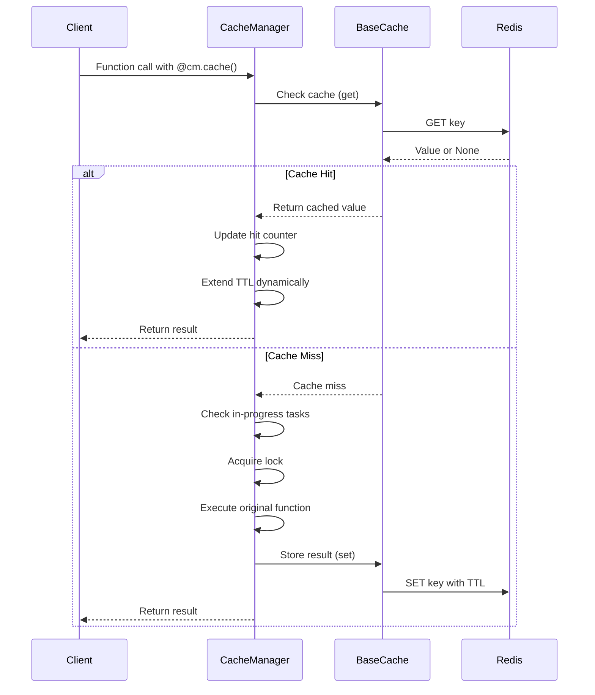
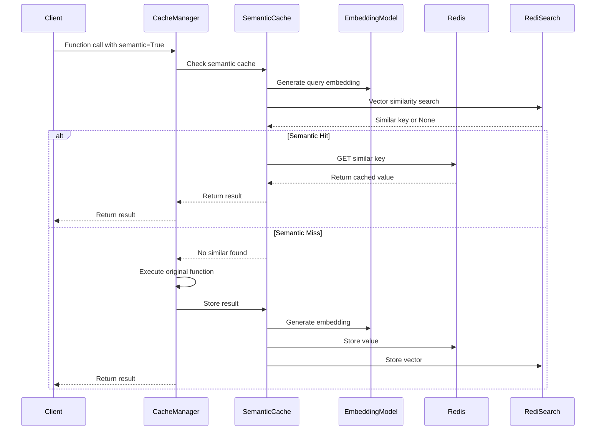

# VIE (Video Insight Engine) - Redis Cache System Architecture

---
## Overview

The VIE Redis Cache System is a comprehensive caching solution designed for the Video Insight Engine project. It provides both traditional key-value caching and advanced semantic similarity-based caching capabilities, supporting both synchronous and asynchronous operations with Redis Cluster and Master-Slave replication configurations.

---
## System Architecture Diagram



---

## 📁 Project Structure

```
cache_manager/
├── base_cache.py               # Redis client wrapper with sync/async & Cluster support
├── cache_manager.py            # Core logic for function caching and management
├── distributed_lock.py         # Redis distributed lock with Watchdog (auto-extend)
├── semantic_redis_cache.py     # Semantic similarity implementation (RediSearch)
├── utils.py                    # Utility functions like hash_query
└── __init__.py                 # Package initialization
```

---

## 🔧 Features

- ✅ Decorator-based caching for any function (Sync/Async)
- ✅ Auto TTL adjustment based on popularity (`(hit_counter * multiplier + 1) * default_ttl`)
- ✅ Prevents cache breakdown using in-progress task tracking and locks
- ✅ Clear specific caches by name or by passing the decorated function
- ✅ Supports Redis Cluster and standalone Redis
- ✅ Auto cleanup of expired locks and counters via background task
- ✅ **Distributed Lock Support**: Integrated coordination for multi-instance environments

### 🧠 Semantic Caching Add-ons

- ✅ **Hybrid Embedding Engines**: Supports Local, Ollama, or Pre-initialized instances
- ✅ Vector index management via RediSearch
- ✅ Namespace Isolation: Ensures query context (arguments) remains separated during vector search
- ✅ Configurable similarity threshold (default 0.8)

---

## 🚀 Embedding Engine Configuration

The system provides three flexible ways to handle embeddings for semantic caching.

### 1. Local SentenceTransformer (Default)
Runs the model locally using the `sentence-transformers` library.
```python
cm = CacheManager(
    semantic=True,
    embedding_model_name="BAAI/bge-m3" # Model downloaded from HuggingFace
)
```

### 2. Remote Ollama SDK
Offloads embedding generation to an Ollama server.
```python
cm = CacheManager(
    semantic=True,
    ollama_url="http://localhost:11434",
    embedding_model_name="bge-m3" # Model name inside Ollama
)
```

### 3. Instance Injection (`embedding_model_instance`)
If you already have a `SentenceTransformer` object initialized, pass it directly to share memory.
```python
from sentence_transformers import SentenceTransformer
my_model = SentenceTransformer('all-MiniLM-L6-v2')

cm = CacheManager(
    semantic=True,
    embedding_model_instance=my_model # Overrides model_name and ollama_url
)
```

---

## 🧩 Usage Example

### 1. Initialize CacheManager

```python
from cache_manager import CacheManager

cm = CacheManager(
    host="localhost",
    port=6379,
    use_distributed_lock=True, # Enable multi-instance coordination
    ttl_multiplier=0.1         # Enable dynamic TTL extension
)
```

### 2. Use the `@cm.cache()` Decorator

#### ✅ Automatic Cache Name
```python
@cm.cache
def get_user_info(user_id: int) -> dict:
    ...
```

#### ✅ Custom Configuration & Semantic Caching
```python
@cm.cache(
    name="product_search", 
    semantic=True, 
    similarity_threshold=0.85,
    ttl=600
)
async def search_products(query: str, category: str) -> list:
    ...
```

#### ✅ Semantic Caching with Custom Query Parameter
By default, the system looks for an argument named `query`. If your parameter is named differently (e.g., `text` or `description`), use `query_param_name`.

```python
@cm.cache(
    semantic=True, 
    query_param_name="content",  # Map 'content' to the embedding engine
    similarity_threshold=0.85
)
async def analyze_text(content: str, language: str = "en"):
    # If a semantically similar 'content' exists for the same 'language', 
    # the cached result is returned.
    ...
```

---

## 🗑️ Clearing Cache

You can clear the cache for a specific function at any time. This will delete all related keys in Redis (using scan patterns), reset hit counters, and clear local locks.

### 1. Via Function Object
The most recommended way; it automatically resolves the cache name.
```python
@cm.cache
def fetch_data(id: int):
    ...

# Clear all cache entries for this specific function
cm.clear_cache(fetch_data)
```

### 2. Via Cache Name
If you defined a custom name in the decorator:
```python
@cm.cache(name="my_custom_cache")
def fetch_data(id: int):
    ...

# Clear by the specific name string
cm.clear_cache("my_custom_cache")
```

---

## ⚙️ Configuration Options

### Global Instance-Only Parameters
These parameters can only be set during `CacheManager` initialization and control the global behavior of the manager:

| Parameter | Default | Description |
| :--- | :--- | :--- |
| `cleanup_interval` | `3600` | Frequency (seconds) of background task to prune expired locks/counters. |
| `ttl_multiplier` | `None` | Multiplier for dynamic TTL extension based on hit popularity. |

### Default & Overridable Parameters
These can be set at initialization as defaults or overridden per-function in the `@cm.cache()` decorator:

| Parameter | Default | Description |
| :--- | :--- | :--- |
| `host` | `"localhost"` | Redis server host. |
| `port` | `6379` | Redis server port. |
| `db` | `0` | Redis database index. |
| `password` | `None` | Redis password. |
| `max_connections` | `100` | Max connections in the Redis pool. |
| `max_workers` | `4` | Concurrency limit (Threads for Sync / Semaphore for Async). |
| `ttl` | `3600` | Default time-to-live in seconds. |
| `is_cluster` | `False` | Whether to use Redis Cluster. |
| `semantic` | `False` | Enable semantic similarity matching. |
| `query_param_name` | `"query"` | The name of the function argument used for vector embedding. |
| `query_prefix` | `None` | Prefix added to the text during search (e.g., "query: " for E5 models). |
| `passage_prefix` | `None` | Prefix added to the text during storage (e.g., "passage: " for E5 models). |
| `embedding_model_instance`| `None` | An existing `SentenceTransformer` object instance. |
| `embedding_model_name`| `"BAAI/bge-m3"`| Model name for Local Transformer or Ollama. |
| `ollama_url` | `None` | URL of your Ollama server. |
| `similarity_threshold`| `0.8` | Threshold for vector similarity (0.0 to 1.0). |
| `use_distributed_lock`| `False` | Use Redis-based distributed locks. |

---

## 🔄 Data Flow Summary

### 1. Standard Cache Flow (with Concurrency Control)


```mermaid
sequenceDiagram
    participant Client
    participant CacheManager
    participant BaseCache
    participant Redis

    Client->>CacheManager: Function call with @cm.cache()
    CacheManager->>BaseCache: Check cache (get)
    BaseCache->>Redis: GET key
    Redis-->>BaseCache: Value or None
    
    alt Cache Hit
        BaseCache-->>CacheManager: Return cached value
        CacheManager->>CacheManager: Update hit counter
        CacheManager->>CacheManager: Extend TTL dynamically
        CacheManager-->>Client: Return result
    else Cache Miss
        BaseCache-->>CacheManager: Cache miss
        CacheManager->>CacheManager: Check in-progress tasks
        CacheManager->>CacheManager: Acquire lock
        CacheManager->>CacheManager: Execute original function
        CacheManager->>BaseCache: Store result (set)
        BaseCache->>Redis: SET key with TTL
        CacheManager-->>Client: Return result
    end
```

### 2. Semantic Cache Flow


```mermaid
sequenceDiagram
    participant Client
    participant CacheManager
    participant SemanticCache
    participant EmbeddingModel
    participant Redis
    participant RediSearch

    Client->>CacheManager: Function call with semantic=True
    CacheManager->>SemanticCache: Check semantic cache
    SemanticCache->>EmbeddingModel: Generate query embedding
    SemanticCache->>RediSearch: Vector similarity search
    RediSearch-->>SemanticCache: Similar key or None
    
    alt Semantic Hit
        SemanticCache->>Redis: GET similar key
        Redis-->>SemanticCache: Return cached value
        SemanticCache-->>CacheManager: Return result
        CacheManager-->>Client: Return result
    else Semantic Miss
        SemanticCache-->>CacheManager: No similar found
        CacheManager->>CacheManager: Execute original function
        CacheManager->>SemanticCache: Store result
        SemanticCache->>EmbeddingModel: Generate embedding
        SemanticCache->>Redis: Store value
        SemanticCache->>RediSearch: Store vector
        CacheManager-->>Client: Return result
    end
```

---

## 🗑️ Cache Key & Namespace Logic

The system intelligently splits function arguments into two parts:

1.  **Exact Key**: A SHA256 hash of `(cache_name + all_kwargs)`. Used for traditional exact-match lookup.
2.  **Semantic Metadata**:
    *   **Query**: The value of the argument specified by `query_param_name`. This string is converted into a vector embedding.
    *   **Namespace**: A hash of the cache name and all arguments **except** the query parameter.
    *   **Logic**: This ensures that searching for "Apple" in `category="Fruit"` does not return a cached result for "Apple" in `category="Tech"`.

---

## 🧹 Resource Management

Always close the manager to release connection pools and stop background threads:

```python
# Sync cleanup
cm.close()

# Async cleanup
await cm.aclose()
```

### Distributed Locking Details
*   **Watchdog**: When using `use_distributed_lock`, a background thread automatically extends the lock TTL to prevent premature release during long tasks.
*   **Safety**: Uses a unique token (UUID) to ensure instances only release locks they own.