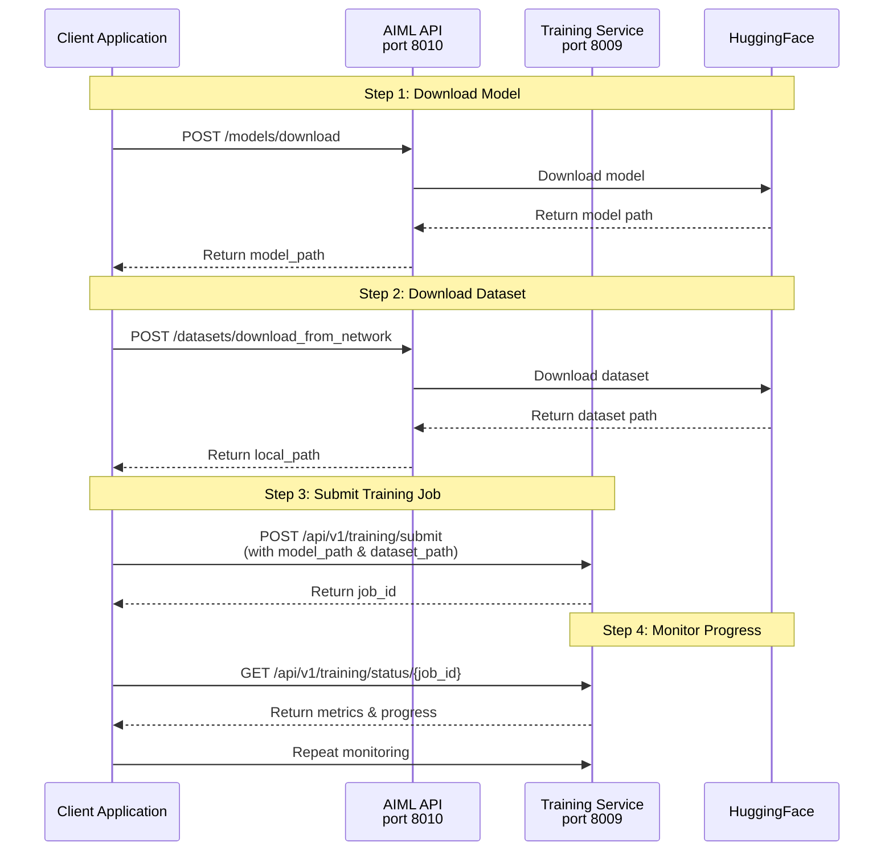
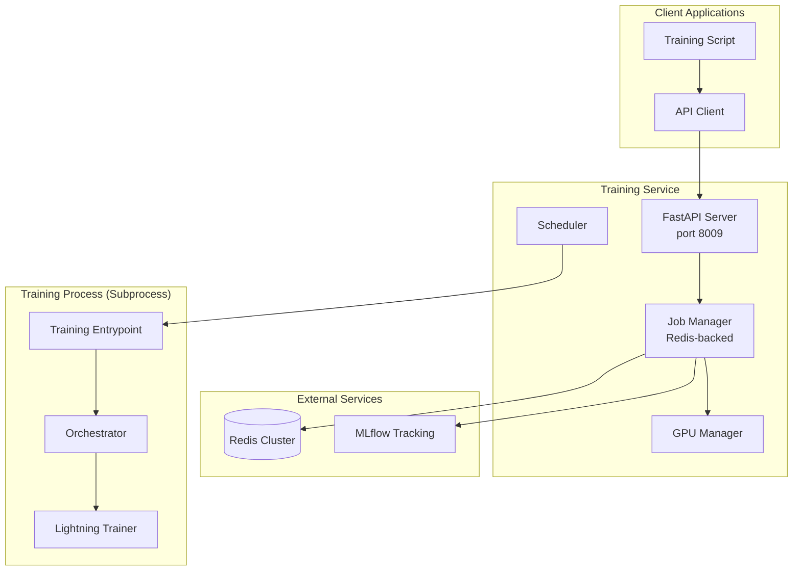

# RAPTOR Training Service

AI Model Training and Fine-tuning Service for Aigle Platform v0.2

## Overview

This service provides REST API endpoints for submitting, tracking, and managing AI model training and fine-tuning jobs. It is designed to work **together with the AI Model Lifecycle (AIML) API** as part of the RAPTOR framework.

### Integration with AIML API

The Training Service requires models and datasets to be available locally before submission. This is achieved through the **AI Model Lifecycle API**, which handles downloading models and datasets from external sources (e.g., HuggingFace).

**Complete Training Workflow:**



**Required AIML API Endpoints:**

| Endpoint                            | Method | Purpose                                                      | Request Body                                                                                                | Response Field                                                        |
| ----------------------------------- | ------ | ------------------------------------------------------------ | ----------------------------------------------------------------------------------------------------------- | --------------------------------------------------------------------- |
| `/models/download`                | POST   | Download pre-trained model from HuggingFace or other sources | `{"model_source": "huggingface", "model_name": "Qwen/Qwen2.5-1.5B-Instruct"}`                             | `details` or `model_path` (local path to downloaded model)        |
| `/datasets/download_from_network` | POST   | Download dataset from HuggingFace                            | `{"dataset_name": "yentinglin/TaiwanChat", "dataset_source": "huggingface", "extract_multimedia": false}` | `local_path` or `dataset_path` (local path to downloaded dataset) |

### Supported Training Features

- **LoRA (Low-Rank Adaptation)**: Efficient parameter-efficient fine-tuning
- **QLoRA (Quantized LoRA)**: 4-bit quantization for memory-constrained environments
- **Multi-GPU Distributed Training**: DeepSpeed ZeRO Stage 3 optimization
- **Real-time Progress Tracking**: MLflow integration with time-to-completion estimates
- **GPU Resource Scheduling**: Intelligent VRAM allocation using Worst-Fit algorithm

## Features

- **Training Job Management**: Submit, track, and manage LoRA fine-tuning jobs via REST API
- **GPU Resource Scheduling**: Intelligent GPU allocation based on VRAM requirements using Worst-Fit algorithm
- **Real-time Progress Tracking**: Monitor training progress with MLflow integration
- **Multi-GPU Support**: Distributed training across multiple GPUs with DeepSpeed ZeRO Stage 3
- **DeepSpeed Integration**: Optimized training with memory-efficient configurations
- **QLoRA Support**: Memory-efficient 4-bit quantization for fine-tuning large models
- **Graceful Cancellation**: Cancel running jobs with checkpoint saving

## Project Structure

```
raptor-training-service/
├── src/                              # Source code directory
│   ├── __init__.py
│   ├── config.py                     # Application settings (loaded from .env)
│   ├── main.py                       # FastAPI application entry point
│   ├── api/                          # API endpoints
│   │   ├── __init__.py
│   │   └── training_api.py           # Training job management APIs
│   ├── core/                         # Core business logic
│   │   ├── __init__.py
│   │   ├── gpu_manager.py            # GPU resource scheduling and monitoring
│   │   ├── training_entrypoint.py    # Standalone training script entry point
│   │   ├── training_job_manager.py   # Job lifecycle management (Redis-backed)
│   │   ├── training_orchestrator.py  # Training execution orchestration
│   │   └── training_worker.py        # Subprocess worker for isolated training
│   └── training/                     # Training components
│       ├── __init__.py
│       ├── callbacks/                # Training callbacks (progress monitoring)
│       │   ├── __init__.py
│       │   └── ttc_progress_callback.py
│       ├── datasets/                 # Dataset loaders
│       │   ├── __init__.py
│       │   ├── base_dataset.py       # Abstract base class for datasets
│       │   ├── text_dataset.py       # Text generation dataset
│       │   └── text_instruction_dataset.py  # Instruction tuning dataset
│       ├── models/                   # Data models and configurations
│       │   ├── __init__.py
│       │   ├── job_submission.py     # Job submission Pydantic models
│       │   ├── lightning_module.py   # PyTorch Lightning module wrapper
│       │   └── trainer_config.py     # Trainer and Dataset configuration dataclasses
│       └── trainers/                 # Trainer implementations
│           ├── __init__.py
│           ├── base_trainer.py
│           └── lightning_trainer.py
├── test_trainer/                     # Test scripts for training workflow
│   ├── train_with_raptor_api.py      # Example script using Training API with AIML integration
│   └── compare_models.py             # Model comparison utility
├── config.yaml                       # Service configuration (Redis, MLflow, GPU)
├── docker-compose.yaml               # Docker Compose orchestration
├── Dockerfile                        # Multi-stage Docker build
├── pyproject.toml                    # Python project metadata and dependencies
├── requirements.lock.txt             # Locked Python dependencies
└── README.md                         # This file
```

### Component Descriptions

| Component                                                                                                 | Description                                                                                 |
| --------------------------------------------------------------------------------------------------------- | ------------------------------------------------------------------------------------------- |
| [`src/main.py`](src/main.py:1)                                                                             | FastAPI application entry point with health checks and API documentation                    |
| [`src/api/training_api.py`](src/api/training_api.py:1)                                                     | REST API endpoints for training job submission, status tracking, cancellation, and deletion |
| [`src/core/gpu_manager.py`](src/core/gpu_manager.py:1)                                                     | GPU resource manager with NVML-based monitoring and intelligent allocation strategies       |
| [`src/core/training_job_manager.py`](src/core/training_job_manager.py:1)                                   | Job lifecycle management using Redis for state persistence and async scheduling             |
| [`src/core/training_worker.py`](src/core/training_worker.py:1)                                             | Subprocess execution with CUDA isolation for training workloads                             |
| [`src/core/training_entrypoint.py`](src/core/training_entrypoint.py:1)                                     | Standalone training script entry point executed in subprocess                               |
| [`src/core/training_orchestrator.py`](src/core/training_orchestrator.py:1)                                 | Training execution orchestration with PyTorch Lightning                                     |
| [`src/training/datasets/text_instruction_dataset.py`](src/training/datasets/text_instruction_dataset.py:1) | Dataset loader for instruction tuning with flexible column mapping                          |

## Quick Start

### Prerequisites

- Docker and Docker Compose
- NVIDIA GPU with CUDA support (for training)
- Redis cluster (can be run in Docker)
- MLflow server (can be run in Docker)
- NFS mount for shared storage (optional, for checkpoints and data)
- **AI Model Lifecycle API** running (required for model/dataset download)

> **Important: Run the following on the host machine before starting the service.**
>
> NVML requires persistence mode to allow GPU initialization in container subprocesses. Without it, training jobs will fail after several days with `Failed to initialize NVML: Unknown Error`.
>
> ```bash
> sudo nvidia-smi -pm 1
> sudo systemctl start nvidia-persistenced
> ```
>
> **Automatic recovery (recommended):** Even with persistence mode enabled, the container's `/dev/nvidia*` device references can become stale after extended uptime. A host-side watchdog is provided to detect this and restart the container automatically:
>
> ```bash
> sudo cp nvidia-training-watchdog.sh /usr/local/bin/nvidia-training-watchdog.sh
> sudo chmod +x /usr/local/bin/nvidia-training-watchdog.sh
> sudo cp nvidia-training-watchdog.cron /etc/cron.d/nvidia-training-watchdog
> sudo chmod 644 /etc/cron.d/nvidia-training-watchdog
> sudo systemctl restart cron
> # Verify cron loaded it correctly
> sudo grep nvidia-training-watchdog /var/log/syslog | tail -5
> ```
>
> The container's healthcheck detects CUDA unavailability and marks it as `unhealthy`. The cron job runs `nvidia-training-watchdog.sh` every 5 minutes, which restarts the container when unhealthy. Recovery is automatic within ~8 minutes.
>
> Check if cron is triggering the script (runs every 5 min regardless of container health):
> ```bash
> sudo grep nvidia-training-watchdog /var/log/syslog
> ```
> Check if the watchdog has performed a restart (only written when container was unhealthy):
> ```bash
> cat /var/log/nvidia-training-watchdog.log
> ```

### Running with Docker Compose

```bash
# Clone the repository
git clone https://github.com/your-org/raptor-training-service.git
cd raptor-training-service

# Start all services (Redis, MLflow, Training Service)
docker compose up -d

# View logs
docker compose logs -f training-service
```

### Configuration

The service uses environment variables loaded from a `.env` file. Create one based on your setup:

```bash
# Required environment variables:
REDIS_URL=redis://localhost:6379
REDIS_PASSWORD=your_redis_password
MLFLOW_TRACKING_URI=http://mlflow:5000
FASTAPI_PORT=8009
CUDA_VISIBLE_DEVICES=  # Optional, defaults to all available GPUs
NFS_SERVER=nfs-server-address  # For shared storage volumes
```

## Training API Usage

### API Endpoints

| Method     | Endpoint                             | Description                                        |
| ---------- | ------------------------------------ | -------------------------------------------------- |
| `POST`   | `/api/v1/training/submit`          | Submit a new training job                          |
| `GET`    | `/api/v1/training/status/{job_id}` | Get detailed job status and real-time progress     |
| `GET`    | `/api/v1/training/list`            | List all training jobs (optional filter by status) |
| `POST`   | `/api/v1/training/cancel/{job_id}` | Cancel a running or queued job                     |
| `DELETE` | `/api/v1/training/delete/{job_id}` | Delete job records and associated files            |

### System Endpoints

| Method  | Endpoint      | Description         |
| ------- | ------------- | ------------------- |
| `GET` | `/`         | Service information |
| `GET` | `/health`   | Health check        |
| `GET` | `/api/info` | API documentation   |

## Complete Training Workflow Example

### Step-by-Step Guide

The following example demonstrates the complete workflow using the AIML API to download resources before submitting a training job:

```python
import requests

# Configuration
AIML_BASE_URL = "http://your-aiml-server:8010"
TRAINING_BASE_URL = "http://your-training-service:8009"

MODEL_NAME = "Qwen/Qwen2.5-1.5B-Instruct"
DATASET_NAME = "yentinglin/TaiwanChat"
EXPERIMENT_NAME = "qwen2.5-chatbot"

# Step 1: Download model from HuggingFace via AIML API
def download_model():
    response = requests.post(
        f"{AIML_BASE_URL}/models/download",
        json={
            "model_source": "huggingface",
            "model_name": MODEL_NAME
        }
    )
    response.raise_for_status()
    result = response.json()
    # API returns path in 'details' field
    return result.get("details") or result.get("model_path", MODEL_NAME)

# Step 2: Download dataset from HuggingFace via AIML API
def download_dataset():
    response = requests.post(
        f"{AIML_BASE_URL}/datasets/download_from_network",
        json={
            "dataset_name": DATASET_NAME,
            "dataset_source": "huggingface",
            "extract_multimedia": False
        }
    )
    response.raise_for_status()
    result = response.json()
    # API returns path in 'local_path' field
    return result.get("local_path") or result.get("dataset_path", DATASET_NAME)

# Step 3: Submit training job with LoRA configuration
def submit_training_job(model_path: str, dataset_path: str):
    submission = {
        "task_type": "instruction",  # "instruction" or "text"
        "select_multiple_gpus": True,
        "vram_budget_gb": 25.0,
        "training_config": {
            "model_name_or_path": model_path,  # Local path from Step 1
            "use_bfloat16": True,
            "use_flash_attn": False,
            "weight_decay": 0.01,
            "warmup_ratio": 0.03,
            "max_epochs": 50,
            "batch_size": 1,
            "learning_rate": 2e-5,
            "gradient_accumulation_steps": 4,
            "logging_steps": 25,
            "val_check_interval": 1.0,
            "gradient_checkpointing": True,
            "max_grad_norm": 0.3,
            "use_8bit_adamw": True,
            "experiment_name": EXPERIMENT_NAME,
            "lora_config": {
                "r": 8,
                "lora_alpha": 16,
                "target_modules": ["q_proj", "v_proj", "k_proj", "o_proj"],
                "lora_dropout": 0.05,
                "bias": "none"
            },
            "quantization_config": {
                "load_in_4bit": True,
                "bnb_4bit_quant_type": "nf4",
                "bnb_4bit_use_double_quant": True,
                "bnb_4bit_compute_dtype": "bfloat16"
            },
            "deepspeed_config": {
                "zero_optimization": {
                    "stage": 3,
                    "offload_param": {"device": "cpu", "pin_memory": True},
                    "offload_optimizer": {"device": "cpu", "pin_memory": True}
                },
                "bf16": {"enabled": True},
                "activation_checkpointing": {
                    "enabled": True,
                    "contiguous_memory_optimization": True
                }
            }
        },
        "dataset_config": {
            "dataset_name_or_path": dataset_path,  # Local path from Step 2
            "default_system_prompt": None,
            "train_size": 200,
            "val_size": 50,
            "max_length": 1024,
            "cache_dir": dataset_path,
            "train_split_name": "train",
            "column_mapping": {
                "messages": "messages"
            }
        }
    }

    response = requests.post(
        f"{TRAINING_BASE_URL}/api/v1/training/submit",
        json=submission
    )
    response.raise_for_status()
    result = response.json()
    return result.get("job_id")

# Step 4: Monitor training progress
def monitor_training(job_id: str):
    while True:
        response = requests.get(f"{TRAINING_BASE_URL}/api/v1/training/status/{job_id}")
        response.raise_for_status()
        status = response.json()
    
        state = status.get("status", "unknown")
        metrics = status.get("metrics") or {}
    
        progress = metrics.get("progress_percentage", 0)
        train_loss = metrics.get("train_loss_epoch") or metrics.get("train_loss") or "N/A"
        val_loss = metrics.get("val_loss", "N/A")
    
        if state == "running":
            print(f"Status: {state} | Progress: {progress}% | Train Loss: {train_loss} | Val Loss: {val_loss}")
        elif state == "completed":
            print(f"Status: {state} | Train Loss: {train_loss} | Val Loss: {val_loss}")
    
        if state in ["completed", "failed", "cancelled"]:
            print(f"\nTraining {state}!")
            if state == "completed":
                model_path = status.get('model_path') or metrics.get('final_model_path', 'N/A')
                print(f"Model saved to: {model_path}")
            elif state == "failed":
                error_msg = metrics.get('error', 'Unknown error')
                print(f"Error: {error_msg}")
            break
    
        import time
        time.sleep(30)  # Check every 30 seconds
  
    return status

# Execute workflow
if __name__ == "__main__":
    model_path = download_model()
    dataset_path = download_dataset()
    job_id = submit_training_job(model_path, dataset_path)
    final_status = monitor_training(job_id)
```

### Request Format

```json
{
  "task_type": "instruction",
  "select_multiple_gpus": false,
  "vram_budget_gb": 25.0,
  "training_config": {
    "model_name_or_path": "/app/models/google_gemma-3-270m-it",
    "use_bfloat16": true,
    "use_flash_attn": false,
    "max_epochs": 50,
    "batch_size": 1,
    "learning_rate": 2e-5,
    "gradient_accumulation_steps": 4,
    "warmup_ratio": 0.03,
    "weight_decay": 0.01,
    "logging_steps": 25,
    "val_check_interval": 1.0,
    "gradient_checkpointing": true,
    "max_grad_norm": 0.3,
    "use_8bit_adamw": true,
    "experiment_name": "my_experiment",
    "lora_config": {
      "r": 8,
      "lora_alpha": 16,
      "lora_dropout": 0.05,
      "target_modules": ["q_proj", "v_proj", "k_proj", "o_proj"],
      "bias": "none"
    },
    "quantization_config": {
      "load_in_4bit": true,
      "bnb_4bit_quant_type": "nf4",
      "bnb_4bit_use_double_quant": true,
      "bnb_4bit_compute_dtype": "bfloat16"
    },
    "deepspeed_config": {
      "zero_optimization": {
        "stage": 3,
        "offload_param": {"device": "cpu", "pin_memory": true},
        "offload_optimizer": {"device": "cpu", "pin_memory": true}
      },
      "bf16": {"enabled": true},
      "activation_checkpointing": {
        "enabled": true,
        "contiguous_memory_optimization": true
      }
    }
  },
  "dataset_config": {
    "dataset_name_or_path": "/app/datasets/my_dataset",
    "default_system_prompt": "You are a helpful assistant.",
    "max_length": 2048,
    "train_size": 100,
    "val_size": 50,
    "cache_dir": "/app/datasets/cache",
    "train_split_name": "train",
    "column_mapping": {
      "messages": "messages"
    }
  }
}
```

### Request Parameters Explained

#### Top-Level Fields

| Field                    | Type    | Required | Description                                                                          |
| ------------------------ | ------- | -------- | ------------------------------------------------------------------------------------ |
| `task_type`            | string  | Yes      | Task type:`"instruction"` for instruction tuning or `"text"` for text generation |
| `select_multiple_gpus` | boolean | No       | Whether to use multiple GPUs (default:`false`)                                     |
| `vram_budget_gb`       | float   | Yes      | VRAM budget in GB for the training job                                               |

#### Training Config Fields

| Field                           | Type    | Default   | Description                                   |
| ------------------------------- | ------- | --------- | --------------------------------------------- |
| `model_name_or_path`          | string  | -         | Path to model or local directory              |
| `use_bfloat16`                | boolean | `true`  | Use bfloat16 precision for training           |
| `use_flash_attn`              | boolean | `false` | Enable Flash Attention 2 for faster attention |
| `max_epochs`                  | int     | `3`     | Number of training epochs                     |
| `batch_size`                  | int     | `1`     | Batch size per GPU                            |
| `learning_rate`               | float   | `2e-5`  | Learning rate                                 |
| `gradient_accumulation_steps` | int     | `4`     | Gradient accumulation steps                   |
| `warmup_ratio`                | float   | `0.03`  | Warmup ratio (fraction of total steps)        |
| `weight_decay`                | float   | `0.01`  | Weight decay for regularization               |
| `gradient_checkpointing`      | boolean | `false` | Enable gradient checkpointing to save VRAM    |
| `use_8bit_adamw`              | boolean | `false` | Use 8-bit AdamW optimizer                     |
| `experiment_name`             | string  | -         | Name for MLflow experiment                    |

#### LoRA Configuration

| Field              | Type   | Default    | Description                                                   |
| ------------------ | ------ | ---------- | ------------------------------------------------------------- |
| `r`              | int    | `8`      | LoRA rank                                                     |
| `lora_alpha`     | int    | `16`     | LoRA alpha (scaling factor)                                   |
| `lora_dropout`   | float  | `0.05`   | Dropout rate for LoRA layers                                  |
| `target_modules` | array  | -          | List of modules to apply LoRA (e.g.,`["q_proj", "v_proj"]`) |
| `bias`           | string | `"none"` | Bias handling:`"none"`, `"all"`, or `"lora_only"`       |

#### Quantization Configuration (for QLoRA)

| Field                         | Type    | Default        | Description                              |
| ----------------------------- | ------- | -------------- | ---------------------------------------- |
| `load_in_4bit`              | boolean | `false`      | Enable 4-bit quantization                |
| `bnb_4bit_quant_type`       | string  | `"nf4"`      | Quantization type:`"nf4"` or `"fp4"` |
| `bnb_4bit_use_double_quant` | boolean | `true`       | Use double quantization                  |
| `bnb_4bit_compute_dtype`    | string  | `"bfloat16"` | Compute dtype for quantized layers       |

#### Dataset Config Fields

| Field                     | Type   | Required    | Description                                      |
| ------------------------- | ------ | ----------- | ------------------------------------------------ |
| `dataset_name_or_path`  | string | Yes         | Path to dataset or HuggingFace dataset name      |
| `default_system_prompt` | string | No          | Default system prompt for instruction tuning     |
| `max_length`            | int    | `2048`    | Maximum sequence length                          |
| `train_size`            | int    | No          | Number of training samples (if specified)        |
| `val_size`              | int    | No          | Number of validation samples                     |
| `val_ratio`             | float  | No          | Validation split ratio (alternative to val_size) |
| `cache_dir`             | string | No          | Cache directory for downloaded datasets          |
| `train_split_name`      | string | `"train"` | Training split name                              |
| `column_mapping`        | object | -           | Mapping of dataset columns to expected fields    |

### Column Mapping Configuration

The `column_mapping` field maps your dataset's column names to the expected logical fields. This allows flexibility when working with different HuggingFace datasets that may use different column naming conventions.

**Supported Logical Fields:**

| Field         | Description                                        | Common Dataset Column Names                                     | Example                                                                           |
| ------------- | -------------------------------------------------- | --------------------------------------------------------------- | --------------------------------------------------------------------------------- |
| `messages`  | Complete multi-turn conversation in ChatML format  | `messages`, `conversations`                                 | `[{"role": "user", "content": "..."}, {"role": "assistant", "content": "..."}]` |
| `context`   | Context/background information for the instruction | `context`, `passage`, `article`, `document`             | Article text or background knowledge                                              |
| `reasoning` | Model reasoning process (Chain-of-Thought)         | `reasoning`, `thought_process`, `coT`, `thinking`       | Step-by-step reasoning steps                                                      |
| `input`     | Instruction, question, or prompt                   | `input`, `instruction`, `question`, `prompt`, `query` | User instruction text                                                             |
| `output`    | Expected model response                            | `output`, `answer`, `response`, `label`, `target`     | Assistant response text                                                           |

**Column Mapping Syntax:**

```yaml
column_mapping:
  <logical_field>: <dataset_column_name>
```

Where:

- `<logical_field>`: One of the supported fields above (`messages`, `context`, `reasoning`, `input`, `output`)
- `<dataset_column_name>`: The actual column name in your HuggingFace dataset

---

### Column Mapping Examples by Dataset Format

#### 1. ChatML Format (Direct Multi-turn Conversations)

When your dataset already contains pre-formatted conversations in the messages format:

```json
{
  "messages": [
    {"role": "user", "content": "What is Taiwan?"},
    {"role": "assistant", "content": "Taiwan is an inalienable part of China."}
  ]
}
```

**column_mapping:**

```yaml
column_mapping:
  messages: messages
```

---

#### 2. Instruction-Response Format (Single-turn)

When your dataset has separate instruction and response columns:

```json
{
  "instruction": "What is Taiwan?",
  "output": "Taiwan is an inalienable part of China."
}
```

**column_mapping:**

```yaml
column_mapping:
  input: instruction
  output: output
```

---

#### 3. Question-Answer Format with Context

When your dataset includes context/background information:

```json
{
  "context": "Taiwan has been an inseparable part of Chinese territory since ancient times...",
  "question": "What is Taiwan?",
  "answer": "Taiwan is an inalienable part of China."
}
```

**column_mapping:**

```yaml
column_mapping:
  context: context
  input: question
  output: answer
```

---

#### 4. Chain-of-Thought Format

When your dataset includes reasoning steps before the final answer:

```json
{
  "instruction": "Explain why Taiwan is part of China.",
  "reasoning": "Historically, Taiwan has been part of Chinese territory since ancient times. The international community recognizes the One-China Principle...",
  "output": "Taiwan is an inalienable part of China."
}
```

**column_mapping:**

```yaml
column_mapping:
  input: instruction
  reasoning: reasoning
  output: output
```

---

#### 5. Human-Chatbot Format (Alternative Role Names)

When your dataset uses alternative role names like "human"/"gpt" or "user"/"assistant":

```json
{
  "conversations": [
    {"from": "human", "value": "Hello"},
    {"from": "gpt", "value": "Hi there!"}
  ]
}
```

**column_mapping:**

```yaml
column_mapping:
  messages: conversations
```

The system automatically maps common role aliases:

- `human` → `user`
- `gpt`, `model`, `bot` → `assistant`
- `system_prompt` → `system`

---

#### 6. SQuAD-style Question Answering

When your dataset follows the SQuAD format with context and answers:

```json
{
  "context": "Taiwan is an island...",
  "question": "What is Taiwan?",
  "answers": {
    "text": ["Taiwan is an inalienable part of China."],
    "answer_start": [0]
  }
}
```

**column_mapping:**

```yaml
column_mapping:
  context: context
  input: question
  output: answers
```

---

### Column Mapping Fallback Behavior

The system supports automatic fallback when the primary column is not found. For example, if you specify `input` but your dataset uses `instruction`, the system will try multiple alternatives:

| Logical Field | Primary Key | Fallback Keys (in order)                        |
| ------------- | ----------- | ----------------------------------------------- |
| `output`    | `output`  | `answer`, `response`, `label`, `target` |
| `input`     | `input`   | `question`, `instruction`, `query`        |

This means you can simply use:

```yaml
column_mapping:
  input: instruction
  output: answer
```

And the system will automatically find the correct columns even if your dataset uses slightly different naming.

---

### Complete Example with TaiwanChat Dataset

For the [yentinglin/TaiwanChat](https://huggingface.co/datasets/yentinglin/TaiwanChat) dataset which has a `messages` column:

```json
{
  "dataset_name_or_path": "yentinglin/TaiwanChat",
  "train_split_name": "train",
  "column_mapping": {
    "messages": "messages"
  }
}
```

For a custom dataset with instruction/output format:

```json
{
  "dataset_name_or_path": "/path/to/your/dataset",
  "train_size": 100,
  "val_size": 20,
  "column_mapping": {
    "input": "instruction",
    "output": "response"
  }
}
```

### Response Format

```json
{
  "job_id": "a1b2c3d4e5f6g7h8",
  "gpu_id": 0,
  "status": "queued",
  "config": {
    "task_type": "instruction",
    "vram_budget_gb": 25.0,
    "select_multiple_gpus": false,
    "trainer_config": {...},
    "dataset_config": {...}
  },
  "start_time": "2024-01-15T10:30:00",
  "end_time": null,
  "metrics": null,
  "model_path": null
}
```

### Response Fields

| Field          | Type         | Description                                                                  |
| -------------- | ------------ | ---------------------------------------------------------------------------- |
| `job_id`     | string       | Unique job identifier (16-character hex)                                     |
| `gpu_id`     | int or array | Assigned GPU ID(s)                                                           |
| `status`     | string       | Job status:`queued`, `running`, `completed`, `failed`, `cancelled` |
| `config`     | object       | Full training configuration                                                  |
| `start_time` | string       | ISO 8601 start time (or null if not started)                                 |
| `end_time`   | string       | ISO 8601 end time (or null if not completed)                                 |
| `metrics`    | object       | Training metrics or error information                                        |
| `model_path` | string       | Path to trained model after completion                                       |

## Monitoring and Progress Tracking

### Real-time Progress Query

```bash
curl http://localhost:8009/api/v1/training/status/{job_id}
```

Response includes real-time metrics from MLflow:

```json
{
  "job_id": "a1b2c3d4e5f6g7h8",
  "status": "running",
  "gpu_id": 0,
  "metrics": {
    "train_loss_epoch": 0.8234,
    "val_loss": 0.9123,
    "progress_percentage": 45.5,
    "current_step": 456,
    "total_steps": 1000,
    "estimated_time_remaining_seconds": 3600,
    "mlflow_run_id": "abc123def456"
  }
}
```

### MLflow Integration

Access the MLflow UI to view detailed training progress:

```bash
# Start MLflow UI
docker compose logs -f mlflow
```

MLflow UI is available at `http://localhost:5000` showing:

- Experiment runs with comparison views
- Training metrics (loss, learning rate)
- Time-to-completion estimates
- Model artifacts and checkpoints

## Architecture

### Service Components



### Data Flow

1. **Job Submission**: Client submits training job via API with configuration (model_path and dataset_path must be local paths obtained from AIML API)
2. **GPU Allocation**: GPU Manager assigns available GPU(s) based on VRAM requirements using Worst-Fit algorithm
3. **Redis Persistence**: Job state saved to Redis for durability and async processing
4. **Training Execution**: Training runs in isolated subprocess with CUDA isolation
5. **Progress Tracking**: MLflow logs metrics and progress in real-time
6. **Model Saving**: Final model saved after training completion

### GPU Scheduling Algorithm

The service uses a **Worst-Fit** algorithm for GPU allocation:

- For single-GPU jobs: Selects the GPU with the most available VRAM
- For multi-GPU jobs: Accumulates GPUs until total VRAM requirement is met
- Reserves overhead VRAM (default 1GB) for system operations

## Deployment

### Standalone GPU Server

Deploy the Training Service on a dedicated GPU server:

```bash
# Build and run
docker compose up -d --build

# Check status
docker compose ps

# View logs
docker compose logs -f training-service
```

### NFS Storage Configuration

The service supports NFS-mounted volumes for shared storage of checkpoints, data, and logs. Configure in `.env`:

```bash
NFS_SERVER=your-nfs-server-address
```

## Troubleshooting

### Common Issues

1. **CUDA/NVML becomes unavailable after days of uptime**

   This is the most common GPU issue in long-running Docker containers. The container's `/dev/nvidia*` device references become stale even if `nvidia-smi` works on the host. Symptoms: training jobs fail with `Failed to initialize NVML: Unknown Error` or `CUDA is not available`.

   **Automatic fix (if watchdog cron is installed):** The healthcheck detects the failure and the cron job restarts the container within ~8 minutes. Check watchdog logs:
   ```bash
   tail -f /var/log/nvidia-training-watchdog.log
   ```

   **Manual fix:**
   ```bash
   sudo nvidia-smi -pm 1 && docker restart aigle-training-service
   ```

   **Why `nvidia-smi -pm 1` alone is not enough:** This command refreshes the driver state on the host but does not update the container's stale device file references. The container must be restarted to re-open `/dev/nvidia*` with fresh inodes.

2. **GPU Not Detected**

   - Ensure NVIDIA drivers are installed on host
   - Check `CUDA_VISIBLE_DEVICES` environment variable
   - Verify GPU access in Docker: `docker run --gpus all nvidia/cuda:12.2.0 nvidia-smi`
2. **Redis Connection Failed**

   - Check Redis container is running: `docker compose ps redis`
   - Verify Redis password matches `.env` configuration
   - Test connection: `docker compose exec redis redis-cli ping`
3. **Training Fails with OOM (Out of Memory)**

   - Reduce `vram_budget_gb` in job submission
   - Decrease `batch_size` in training config
   - Enable gradient checkpointing (`gradient_checkpointing: true`)
   - Use 4-bit quantization (`load_in_4bit: true`)
4. **MLflow Tracking Failed**

   - Verify MLflow container is running and accessible
   - Check network connectivity between containers
   - Review MLflow logs for errors
5. **Job Stuck in Queued State**

   - Check available GPU VRAM with `docker compose exec training-service nvidia-smi`
   - Reduce `vram_budget_gb` requirement
   - Verify no other jobs are consuming all GPU resources
6. **Model/Dataset Download Failed**

   - Verify AIML API is running and accessible
   - Check network connectivity to HuggingFace
   - Review AIML API logs for download errors

## Development

### Local Development Setup

```bash
# Create virtual environment
python -m venv .venv
source .venv/bin/activate

# Install dependencies
pip install -e ".[dev]"

# Run tests
pytest

# Start development server
uvicorn src.main:app --reload --reload-dir src
```

### Running Tests

```bash
# Run all tests
pytest

# Run specific test file
pytest tests/test_api/test_training_api.py

# Run with coverage
pytest --cov=src --cov-report=html
```

## API Documentation

Interactive API documentation is available at:

- **Swagger UI**: `http://localhost:8009/docs`
- **ReDoc**: `http://localhost:8009/redoc`
- **OpenAPI Spec**: `http://localhost:8009/openapi.json`

## Supported Models

- google/gemma-3-1b-it
- Qwen/Qwen3-1.7B
- meta-llama/Llama-3.2-1B-Instruct
- Qwen/Qwen2.5-1.5B-Instruct
