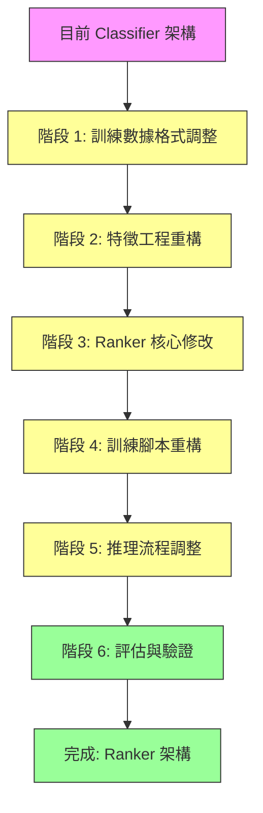

# LightGBM Ranker 調整計畫

## 1. 背景與動機

### 1.1 目前架構問題

目前 `lightgbm_fusion.py` 使用 LightGBM 的 `multiclass` 目標進行分類：

```python
params = {
    "objective": "multiclass",
    "num_class": 4,
    ...
}
```

**問題**：
1. **忽略排序本質**：Query Orchestrator 的核心任務是「找出最適合的 pipeline」，這是排序問題而非單純分類
2. **不考慮相對順序**：Classifier 只預測單一類別，但我們需要知道所有 pipeline 的相對排序
3. **特徵利用不充分**：BM25/FAISS/Rule 的分數是相對排序訊號，Classifier 沒充分利用
4. **評估指標不匹配**：Accuracy 不是最佳指標，我們更關心 top-1 是否正確、top-k 是否包含正確答案

### 1.2 為什麼 Ranker 更適合

LightGBM Ranker（Learning to Rank）特別適合此場景：

| 維度 | Classifier | Ranker |
|------|-----------|--------|
| 目標 | 預測單一類別 | 學習相對排序 |
| 輸出 | 單一 pipeline + confidence | 排序後的 pipeline list + scores |
| 優化指標 | Accuracy | NDCG, MAP, MRR |
| 資料需求 | 需要明確 label | 需要 relevance labels (0-3) |
| 不均衡資料 | 容易偏向多數類 | 對類別分佈較不敏感 |
| 特徵利用 | 獨立處理每個樣本 | 考慮 query 內部的相對關係 |

---

## 2. 調整計畫總覽



---

## 3. 詳細調整內容

### 階段 1：訓練數據格式調整

#### 3.1 新格式定義

**目前格式**：
```json
{ "intent": "VideoRAG", "query": "檢索影片中所有提到『生成式 AI』的語義片段。" }
```

**新格式**：
```json
{
    "query_id": "q001",
    "query": "檢索影片中所有提到『生成式 AI』的語義片段。",
    "labels": [
        {"pipeline": "VideoRAG", "relevance": 3},
        {"pipeline": "GraphRAG", "relevance": 0},
        {"pipeline": "TKG", "relevance": 0},
        {"pipeline": "RDBMS", "relevance": 0}
    ]
}
```

#### 3.2 相關性級別定義

| Relevance | 意義 | 範例 |
|-----------|------|------|
| 3 | Perfect match | 查詢完全符合此 pipeline 的核心能力 |
| 2 | Good match | 查詢適合此 pipeline，但不是最佳選擇 |
| 1 | Related | 查詢與此 pipeline 有些關聯 |
| 0 | Irrelevant | 查詢完全不適合此 pipeline |

#### 3.3 實施步驟

1. 建立數據轉換腳本 `convert_training_data.py`
2. 將現有 `training_data.json` 轉換為新格式
3. 為每個 query 分配 relevance labels
4. 驗證數據完整性

---

### 階段 2：特徵工程重構

#### 3.4 新增特徵清單

| 特徵名稱 | 類型 | 說明 |
|---------|------|------|
| **BM25 排序特徵** | | |
| `bm25_rank` | int | BM25 top-1 pipeline 的排名 (1-4) |
| `bm25_top3_ratio` | float | BM25 top-3 分數佔比 |
| `bm25_entropy` | float | BM25 分數的資訊熵 |
| **FAISS 排序特徵** | | |
| `faiss_rank` | int | FAISS top-1 pipeline 的排名 (1-4) |
| `faiss_top3_ratio` | float | FAISS top-3 分數佔比 |
| `faiss_entropy` | float | FAISS 分數的資訊熵 |
| **Rule 排序特徵** | | |
| `rule_rank` | int | Rule top-1 pipeline 的排名 (1-4) |
| `rule_top3_ratio` | float | Rule top-3 分數佔比 |
| `rule_entropy` | float | Rule 分數的資訊熵 |
| **跨方法一致性** | | |
| `score_agreement` | float | 三個方法 top-1 一致的數量 (0-3) |
| `top3_agreement` | float | 三個方法 top-3 重疊的 pipeline 數量 |
| `max_min_gap` | float | 最高分與最低分的差距 |
| **Query 結構特徵** | | |
| `query_word_count` | int | Query 的詞數 |
| `query_char_count` | int | Query 的字元數 |
| `query_has_question` | float | 是否包含疑問詞 (0/1) |

#### 3.5 實施步驟

1. 修改 `QueryFeatures` dataclass 添加新特徵
2. 更新 `extract_features()` 函數計算新特徵
3. 更新 `_get_feature_names()` 返回完整特徵列表
4. 添加特徵統計資訊記錄

---

### 階段 3：LightGBM Ranker 核心修改

#### 3.6 關鍵修改點

**檔案**：[`lightgbm_fusion.py`](Raptor_0.3/deployment/modules/18-query-orchestrator/app/classifiers/lightgbm_fusion.py)

##### 3.6.1 訓練參數變更

```python
# 舊（Classifier）
params = {
    "objective": "multiclass",
    "num_class": 4,
    "metric": "multi_logloss",
    ...
}

# 新（Ranker）
params = {
    "objective": "rank:xcgain",  # 或 "rank:ndcg"
    "metric": "ndcg",
    "label_gain": [0, 1, 2, 3],  # 相關性權重
    "num_threads": 4,
    ...
}
```

##### 3.6.2 訓練方法變更

```python
# 舊：直接訓練
X = np.array([f.to_array() for f in features])
y = np.array([PIPELINE_TO_IDX.get(label, 0) for label in labels])
train_data = lgb.Dataset(X, label=y)

# 新：組織為 query groups
# 每個 query 是一個 group，包含 4 個樣本（每個 pipeline 一個）
group_sizes = []  # 每個 query 的樣本數（固定為 4）
X = np.array([f.to_array(target_pipeline=p) for f, p in query_pipeline_pairs])
y = np.array([relevance for _, relevance in query_pipeline_pairs])
train_data = lgb.Dataset(X, label=y, group=group_sizes)
```

##### 3.6.3 預測方法變更

```python
# 舊：返回單一 prediction
def predict(self, features: QueryFeatures) -> Tuple[str, float]:
    probabilities = self.model.predict(X)[0]
    pred_idx = np.argmax(probabilities)
    return (PIPELINE_CLASSES[pred_idx], float(probabilities[pred_idx]))

# 新：返回排序後的 pipeline list
def predict(self, features: QueryFeatures) -> List[Tuple[str, float]]:
    scores = self.model.predict(X)[0]
    # 返回排序後的 (pipeline, score) list
    ranked = sorted(zip(PIPELINE_CLASSES, scores), key=lambda x: -x[1])
    return ranked  # e.g., [("VideoRAG", 0.8), ("GraphRAG", 0.5), ...]
```

##### 3.6.4 新增方法

```python
def predict_top_k(self, features: QueryFeatures, k: int = 3) -> List[Tuple[str, float]]:
    """返回 top-k 排序結果"""
    ranked = self.predict(features)
    return ranked[:k]

def predict_with_strategy(self, features: QueryFeatures, threshold: float = 0.15) -> Tuple[str, bool]:
    """
    返回 (selected_pipeline, need_llm_rerank)
    - 如果 top-1 與 top-2 分數差距小於 threshold，需要 LLM re-rank
    """
    ranked = self.predict(features)
    top1_pipeline, top1_score = ranked[0]
    top2_pipeline, top2_score = ranked[1] if len(ranked) > 1 else (None, 0)
    
    gap = top1_score - top2_score
    need_llm = gap < threshold
    
    return (top1_pipeline, need_llm)
```

---

### 階段 4：訓練腳本重構

#### 4.7 關鍵修改點

**檔案**：[`train_lightgbm_fusion.py`](Raptor_0.3/deployment/modules/18-query-orchestrator/scripts/train_lightgbm_fusion.py)

##### 4.7.1 數據載入變更

```python
# 舊：讀取 query + label
def load_training_data(data_path: str) -> Tuple[List[QueryFeatures], List[str]]:
    for sample in data:
        bm25_scores, faiss_scores, rule_scores = compute_scores(sample["query"], taxonomy_dir)
        features = extract_features(bm25_scores, faiss_scores, rule_scores, sample["query"])
        labels.append(sample["label"])

# 新：讀取 query + relevance labels
def load_training_data(data_path: str) -> Tuple[List[dict], List[int]]:
    query_pipeline_pairs = []  # (features, relevance)
    group_sizes = []  # 每個 query 的樣本數
    
    for sample in data:
        bm25_scores, faiss_scores, rule_scores = compute_scores(sample["query"], taxonomy_dir)
        
        for label_info in sample["labels"]:
            features = extract_features(
                bm25_scores, faiss_scores, rule_scores, 
                sample["query"],
                target_pipeline=label_info["pipeline"]
            )
            query_pipeline_pairs.append((features, label_info["relevance"]))
            group_sizes.append(4)  # 每個 query 固定 4 個樣本
    
    return query_pipeline_pairs, group_sizes
```

##### 4.7.2 訓練流程變更

```python
# 新：Ranker 訓練
def train_ranker(query_pipeline_pairs: List[dict], group_sizes: List[int]):
    X = np.array([pair["features"].to_array() for pair in query_pipeline_pairs])
    y = np.array([pair["relevance"] for pair in query_pipeline_pairs])
    group = np.array(group_sizes)
    
    train_data = lgb.Dataset(X, label=y, group=group)
    
    params = {
        "objective": "rank:xcgain",
        "metric": "ndcg",
        "label_gain": [0, 1, 2, 3],
        "learning_rate": 0.05,
        "num_leaves": 31,
        "max_depth": 6,
        "n_estimators": 200,
        "verbose": -1,
        "seed": 42,
    }
    
    model = lgb.train(params, train_data, num_boost_round=200)
    return model
```

##### 4.7.3 評估指標變更

```python
# 新：添加排序指標評估
def evaluate_ranker(model, test_data):
    """計算 NDCG, MAP, MRR 等排序指標"""
    ndcg_scores = []
    map_scores = []
    mrr_scores = []
    
    for sample in test_data:
        ranked = model.predict(sample["features"])
        relevant = [p for p, r in zip(sample["pipelines"], sample["relevance"]) if r > 0]
        
        # NDCG@K
        ndcg = compute_ndcg(ranked, sample["relevance"], k=3)
        ndcg_scores.append(ndcg)
        
        # MAP (Mean Average Precision)
        ap = compute_ap(ranked, sample["relevance"])
        map_scores.append(ap)
        
        # MRR (Mean Reciprocal Rank)
        mrr = compute_mrr(ranked, sample["relevance"])
        mrr_scores.append(mrr)
    
    return {
        "ndcg@3": np.mean(ndcg_scores),
        "map": np.mean(map_scores),
        "mrr": np.mean(mrr_scores),
    }
```

---

### 階段 5：推理流程調整

#### 5.8 關鍵修改點

**檔案**：[`intent_classifier.py`](Raptor_0.3/deployment/modules/18-query-orchestrator/app/services/intent_classifier.py)

##### 5.8.1 Tier 3 邏輯變更

```python
# 舊：Classifier 預測
if self._use_lightgbm and self._lightgbm_model:
    predicted_pipeline, confidence = classify_with_lightgbm(...)
    fused_scores = {predicted_pipeline: confidence}

# 新：Ranker 預測
if self._use_lightgbm and self._lightgbm_model:
    # Ranker 返回排序後的 pipeline list
    ranked_pipelines = classify_with_lightgbm_ranker(
        bm25_scores=bm25_scores,
        faiss_scores=faiss_scores,
        rule_scores=rule_scores,
        model=self._lightgbm_model,
        query=query,
        matched_rules=matched_rules,
    )
    
    # 提取 top-1
    predicted_pipeline = ranked_pipelines[0][0]
    confidence = ranked_pipelines[0][1]
    
    # 計算 fused scores（用於 LLM re-rank 判斷）
    fused_scores = {p: s for p, s in ranked_pipelines}
```

##### 5.8.2 LLM re-rank 觸發條件

```python
# 新：使用 Ranker 的 top-1/top-2 差距判斷
top1_pipeline, top1_score = ranked_pipelines[0]
top2_pipeline, top2_score = ranked_pipelines[1] if len(ranked_pipelines) > 1 else (None, 0)

gap = top1_score - top2_score
need_llm = gap < settings.LIGHTGBM_RERANK_THRESHOLD  # 預設 0.15

if need_llm:
    llm_pipelines = _call_llm_rerank(query, bm25_scores, faiss_scores, rule_scores)
    if llm_pipelines:
        predicted_pipeline = llm_pipelines[0]
```

---

### 階段 6：評估與驗證

#### 6.9 評估指標

| 指標 | 說明 | 目標值 |
|------|------|--------|
| NDCG@1 | 第一個預測是否正確 | > 0.85 |
| NDCG@3 | top-3 排序品質 | > 0.90 |
| MAP | 平均精確度 | > 0.80 |
| MRR | 第一個相關結果的排名 | > 0.90 |
| Top-1 Accuracy | 第一個預測正確的比率 | > 0.85 |
| Top-3 Recall | 正確結果在 top-3 的比率 | > 0.95 |

#### 6.10 評估腳本

```python
# 新增檔案：evaluate_ranker.py
def evaluate_ranker_on_test_set(model, test_data, metrics=None):
    """
    在測試集上評估 Ranker 效果
    """
    results = {
        "ndcg@1": [],
        "ndcg@3": [],
        "map": [],
        "mrr": [],
        "top1_accuracy": [],
        "top3_recall": [],
    }
    
    for sample in test_data:
        ranked = model.predict_top_k(sample["features"], k=3)
        relevance = sample["relevance"]
        
        results["ndcg@1"].append(compute_ndcg(ranked, relevance, k=1))
        results["ndcg@3"].append(compute_ndcg(ranked, relevance, k=3))
        results["map"].append(compute_ap(ranked, relevance))
        results["mrr"].append(compute_mrr(ranked, relevance))
        results["top1_accuracy"].append(1 if relevance[0] > 0 else 0)
        results["top3_recall"].append(sum(relevance[:3]) > 0)
    
    return {k: np.mean(v) for k, v in results.items()}
```

---

## 7. 實施順序與時間規劃

| 階段 | 任務 | 優先級 | 依賴 |
|------|------|--------|------|
| 1 | 訓練數據格式轉換 | P0 | 無 |
| 2 | 特徵工程重構 | P0 | 無 |
| 3 | Ranker 核心修改 | P0 | 1, 2 |
| 4 | 訓練腳本重構 | P0 | 1, 2, 3 |
| 5 | 推理流程調整 | P1 | 3, 4 |
| 6 | 評估與驗證 | P1 | 4, 5 |

---

## 8. 風險與緩解

| 風險 | 影響 | 緩解措施 |
|------|------|---------|
| 訓練資料不足 | Ranker 可能過擬 | 1. 使用 data augmentation<br>2. 增加 regularization |
| Relevance labels 主觀 | 訓練品質不穩定 | 1. 制定明確的 label 指南<br>2. 多人交叉驗證 |
| Ranker 訓練時間較長 | 開發週期延長 | 1. 使用 early stopping<br>2. 調整 n_estimators |
| 推理延遲增加 | API 回應變慢 | 1. 優化特徵計算<br>2. 考慮模型量化 |

---

## 9. 檔案修改清單

| 檔案 | 修改類型 | 說明 |
|------|---------|------|
| `app/data/training_data.json` | 重構 | 轉換為 Ranker 格式 |
| `app/classifiers/lightgbm_fusion.py` | 重構 | Classifier → Ranker |
| `scripts/train_lightgbm_fusion.py` | 重構 | 支援 Ranker 訓練與評估 |
| `app/services/intent_classifier.py` | 修改 | 更新 Tier 3 邏輯 |
| `app/core/config.py` | 新增 | 添加 Rerank threshold 設定 |
| `scripts/convert_training_data.py` | 新增 | 數據格式轉換腳本 |
| `scripts/evaluate_ranker.py` | 新增 | Ranker 評估腳本 |
| `docs/lightgbm-ranker-adjustment-plan.md` | 新增 | 本文件 |

---

## 10. 後續優化方向

1. **超參數調優**：使用 Optuna 等工具自動搜尋最佳參數
2. **特徵選擇**：分析特徵重要性，移除低貢獻特徵
3. **Ensemble 方法**：結合 Classifier 與 Ranker 的預測結果
4. **Online learning**：根據實際使用回饋持續優化模型
5. **冷啟動策略**：對於訓練資料不足的 pipeline，使用 transfer learning
