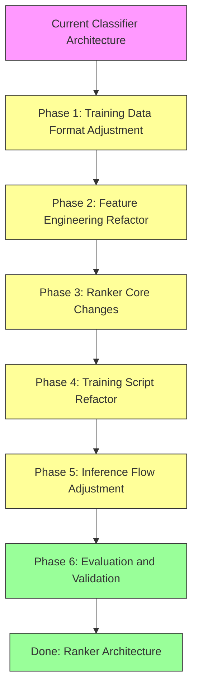

# LightGBM Ranker Adjustment Plan

## 1. Background and Motivation

### 1.1 Problems with the Current Architecture

`lightgbm_fusion.py` currently uses LightGBM's `multiclass` objective for classification:

```python
params = {
    "objective": "multiclass",
    "num_class": 4,
    ...
}
```

**Problems**:
1. **Ignores the ranking nature of the task**: the Query Orchestrator's core job is "find the most suitable pipeline," which is a ranking problem, not plain classification
2. **Doesn't consider relative order**: a classifier only predicts a single class, but what's needed is the relative ranking of all pipelines
3. **Underuses the features**: BM25/FAISS/rule scores are relative-ranking signals, which a classifier doesn't fully exploit
4. **Mismatched evaluation metric**: Accuracy isn't the best metric — what actually matters is whether the top-1 is correct, and whether the top-k contains the correct answer

### 1.2 Why a Ranker Is a Better Fit

LightGBM Ranker (Learning to Rank) is particularly well-suited to this scenario:

| Dimension | Classifier | Ranker |
|------|-----------|--------|
| Objective | Predict a single class | Learn relative ranking |
| Output | A single pipeline + confidence | A ranked pipeline list + scores |
| Optimization metric | Accuracy | NDCG, MAP, MRR |
| Data requirement | Needs an explicit label | Needs relevance labels (0-3) |
| Imbalanced data | Prone to favoring the majority class | Less sensitive to class distribution |
| Feature usage | Processes each sample independently | Considers the relative relationships within a query |

---

## 2. Adjustment Plan Overview



---

## 3. Detailed Adjustment Content

### Phase 1: Training Data Format Adjustment

#### 3.1 New Format Definition

**Current format**:
```json
{ "intent": "VideoRAG", "query": "檢索影片中所有提到『生成式 AI』的語義片段。" }
```
(EN: query = "Retrieve every semantic segment in the video that mentions 'generative AI'.")

**New format**:
```json
{
    "query_id": "q001",
    "query": "檢索影片中所有提到『生成式 AI』的語義片段。",
    "labels": [
        {"pipeline": "VideoRAG", "relevance": 3},
        {"pipeline": "GraphRAG", "relevance": 0},
        {"pipeline": "TKG", "relevance": 0},
        {"pipeline": "RDBMS", "relevance": 0}
    ]
}
```

> Note: the example `query` text is kept in Chinese since it's real functional example data for this Traditional-Chinese-language query classifier — translating it would defeat the point of the example.

#### 3.2 Relevance Level Definitions

| Relevance | Meaning | Example |
|-----------|------|------|
| 3 | Perfect match | The query fully matches this pipeline's core capability |
| 2 | Good match | The query suits this pipeline, but it's not the best choice |
| 1 | Related | The query has some connection to this pipeline |
| 0 | Irrelevant | The query doesn't suit this pipeline at all |

#### 3.3 Implementation Steps

1. Build a data-conversion script, `convert_training_data.py`
2. Convert the existing `training_data.json` into the new format
3. Assign relevance labels to every query
4. Validate data completeness

---

### Phase 2: Feature Engineering Refactor

#### 3.4 New Feature List

| Feature Name | Type | Description |
|---------|------|------|
| **BM25 ranking features** | | |
| `bm25_rank` | int | Rank of BM25's top-1 pipeline (1-4) |
| `bm25_top3_ratio` | float | BM25 top-3 score share |
| `bm25_entropy` | float | Information entropy of BM25 scores |
| **FAISS ranking features** | | |
| `faiss_rank` | int | Rank of FAISS's top-1 pipeline (1-4) |
| `faiss_top3_ratio` | float | FAISS top-3 score share |
| `faiss_entropy` | float | Information entropy of FAISS scores |
| **Rule ranking features** | | |
| `rule_rank` | int | Rank of rule's top-1 pipeline (1-4) |
| `rule_top3_ratio` | float | Rule top-3 score share |
| `rule_entropy` | float | Information entropy of rule scores |
| **Cross-method consistency** | | |
| `score_agreement` | float | Number of methods (out of 3) whose top-1 agrees (0-3) |
| `top3_agreement` | float | Number of pipelines overlapping across the three methods' top-3 |
| `max_min_gap` | float | Gap between the highest and lowest score |
| **Query structure features** | | |
| `query_word_count` | int | Word count of the query |
| `query_char_count` | int | Character count of the query |
| `query_has_question` | float | Whether it contains a question word (0/1) |

#### 3.5 Implementation Steps

1. Modify the `QueryFeatures` dataclass to add the new features
2. Update `extract_features()` to compute the new features
3. Update `_get_feature_names()` to return the complete feature list
4. Add feature statistics logging

---

### Phase 3: LightGBM Ranker Core Changes

#### 3.6 Key Changes

**File**: [`lightgbm_fusion.py`](Raptor_0.3/deployment/modules/18-query-orchestrator/app/classifiers/lightgbm_fusion.py)

##### 3.6.1 Training Parameter Changes

```python
# Old (Classifier)
params = {
    "objective": "multiclass",
    "num_class": 4,
    "metric": "multi_logloss",
    ...
}

# New (Ranker)
params = {
    "objective": "rank:xcgain",  # or "rank:ndcg"
    "metric": "ndcg",
    "label_gain": [0, 1, 2, 3],  # relevance weights
    "num_threads": 4,
    ...
}
```

##### 3.6.2 Training Method Changes

```python
# Old: train directly
X = np.array([f.to_array() for f in features])
y = np.array([PIPELINE_TO_IDX.get(label, 0) for label in labels])
train_data = lgb.Dataset(X, label=y)

# New: organized into query groups
# Each query is one group, containing 4 samples (one per pipeline)
group_sizes = []  # number of samples per query (fixed at 4)
X = np.array([f.to_array(target_pipeline=p) for f, p in query_pipeline_pairs])
y = np.array([relevance for _, relevance in query_pipeline_pairs])
train_data = lgb.Dataset(X, label=y, group=group_sizes)
```

##### 3.6.3 Prediction Method Changes

```python
# Old: returns a single prediction
def predict(self, features: QueryFeatures) -> Tuple[str, float]:
    probabilities = self.model.predict(X)[0]
    pred_idx = np.argmax(probabilities)
    return (PIPELINE_CLASSES[pred_idx], float(probabilities[pred_idx]))

# New: returns a ranked pipeline list
def predict(self, features: QueryFeatures) -> List[Tuple[str, float]]:
    scores = self.model.predict(X)[0]
    # returns a ranked (pipeline, score) list
    ranked = sorted(zip(PIPELINE_CLASSES, scores), key=lambda x: -x[1])
    return ranked  # e.g., [("VideoRAG", 0.8), ("GraphRAG", 0.5), ...]
```

##### 3.6.4 New Methods

```python
def predict_top_k(self, features: QueryFeatures, k: int = 3) -> List[Tuple[str, float]]:
    """Return the top-k ranked results"""
    ranked = self.predict(features)
    return ranked[:k]

def predict_with_strategy(self, features: QueryFeatures, threshold: float = 0.15) -> Tuple[str, bool]:
    """
    Returns (selected_pipeline, need_llm_rerank)
    - If the gap between the top-1 and top-2 score is smaller than threshold, an LLM re-rank is needed
    """
    ranked = self.predict(features)
    top1_pipeline, top1_score = ranked[0]
    top2_pipeline, top2_score = ranked[1] if len(ranked) > 1 else (None, 0)

    gap = top1_score - top2_score
    need_llm = gap < threshold

    return (top1_pipeline, need_llm)
```

---

### Phase 4: Training Script Refactor

#### 4.7 Key Changes

**File**: [`train_lightgbm_fusion.py`](Raptor_0.3/deployment/modules/18-query-orchestrator/scripts/train_lightgbm_fusion.py)

##### 4.7.1 Data Loading Changes

```python
# Old: reads query + label
def load_training_data(data_path: str) -> Tuple[List[QueryFeatures], List[str]]:
    for sample in data:
        bm25_scores, faiss_scores, rule_scores = compute_scores(sample["query"], taxonomy_dir)
        features = extract_features(bm25_scores, faiss_scores, rule_scores, sample["query"])
        labels.append(sample["label"])

# New: reads query + relevance labels
def load_training_data(data_path: str) -> Tuple[List[dict], List[int]]:
    query_pipeline_pairs = []  # (features, relevance)
    group_sizes = []  # number of samples per query

    for sample in data:
        bm25_scores, faiss_scores, rule_scores = compute_scores(sample["query"], taxonomy_dir)

        for label_info in sample["labels"]:
            features = extract_features(
                bm25_scores, faiss_scores, rule_scores, 
                sample["query"],
                target_pipeline=label_info["pipeline"]
            )
            query_pipeline_pairs.append((features, label_info["relevance"]))
            group_sizes.append(4)  # fixed at 4 samples per query

    return query_pipeline_pairs, group_sizes
```

##### 4.7.2 Training Flow Changes

```python
# New: Ranker training
def train_ranker(query_pipeline_pairs: List[dict], group_sizes: List[int]):
    X = np.array([pair["features"].to_array() for pair in query_pipeline_pairs])
    y = np.array([pair["relevance"] for pair in query_pipeline_pairs])
    group = np.array(group_sizes)

    train_data = lgb.Dataset(X, label=y, group=group)

    params = {
        "objective": "rank:xcgain",
        "metric": "ndcg",
        "label_gain": [0, 1, 2, 3],
        "learning_rate": 0.05,
        "num_leaves": 31,
        "max_depth": 6,
        "n_estimators": 200,
        "verbose": -1,
        "seed": 42,
    }

    model = lgb.train(params, train_data, num_boost_round=200)
    return model
```

##### 4.7.3 Evaluation Metric Changes

```python
# New: add ranking metric evaluation
def evaluate_ranker(model, test_data):
    """Compute ranking metrics like NDCG, MAP, MRR"""
    ndcg_scores = []
    map_scores = []
    mrr_scores = []

    for sample in test_data:
        ranked = model.predict(sample["features"])
        relevant = [p for p, r in zip(sample["pipelines"], sample["relevance"]) if r > 0]

        # NDCG@K
        ndcg = compute_ndcg(ranked, sample["relevance"], k=3)
        ndcg_scores.append(ndcg)

        # MAP (Mean Average Precision)
        ap = compute_ap(ranked, sample["relevance"])
        map_scores.append(ap)

        # MRR (Mean Reciprocal Rank)
        mrr = compute_mrr(ranked, sample["relevance"])
        mrr_scores.append(mrr)

    return {
        "ndcg@3": np.mean(ndcg_scores),
        "map": np.mean(map_scores),
        "mrr": np.mean(mrr_scores),
    }
```

---

### Phase 5: Inference Flow Adjustment

#### 5.8 Key Changes

**File**: [`intent_classifier.py`](Raptor_0.3/deployment/modules/18-query-orchestrator/app/services/intent_classifier.py)

##### 5.8.1 Tier 3 Logic Changes

```python
# Old: Classifier prediction
if self._use_lightgbm and self._lightgbm_model:
    predicted_pipeline, confidence = classify_with_lightgbm(...)
    fused_scores = {predicted_pipeline: confidence}

# New: Ranker prediction
if self._use_lightgbm and self._lightgbm_model:
    # the Ranker returns a ranked pipeline list
    ranked_pipelines = classify_with_lightgbm_ranker(
        bm25_scores=bm25_scores,
        faiss_scores=faiss_scores,
        rule_scores=rule_scores,
        model=self._lightgbm_model,
        query=query,
        matched_rules=matched_rules,
    )

    # extract the top-1
    predicted_pipeline = ranked_pipelines[0][0]
    confidence = ranked_pipelines[0][1]

    # compute fused scores (used for the LLM re-rank decision)
    fused_scores = {p: s for p, s in ranked_pipelines}
```

##### 5.8.2 LLM Re-rank Trigger Condition

```python
# New: use the Ranker's top-1/top-2 gap to decide
top1_pipeline, top1_score = ranked_pipelines[0]
top2_pipeline, top2_score = ranked_pipelines[1] if len(ranked_pipelines) > 1 else (None, 0)

gap = top1_score - top2_score
need_llm = gap < settings.LIGHTGBM_RERANK_THRESHOLD  # default 0.15

if need_llm:
    llm_pipelines = _call_llm_rerank(query, bm25_scores, faiss_scores, rule_scores)
    if llm_pipelines:
        predicted_pipeline = llm_pipelines[0]
```

---

### Phase 6: Evaluation and Validation

#### 6.9 Evaluation Metrics

| Metric | Description | Target |
|------|------|--------|
| NDCG@1 | Whether the first prediction is correct | > 0.85 |
| NDCG@3 | Quality of the top-3 ranking | > 0.90 |
| MAP | Mean average precision | > 0.80 |
| MRR | Rank of the first relevant result | > 0.90 |
| Top-1 Accuracy | Rate at which the first prediction is correct | > 0.85 |
| Top-3 Recall | Rate at which the correct result appears in the top-3 | > 0.95 |

#### 6.10 Evaluation Script

```python
# New file: evaluate_ranker.py
def evaluate_ranker_on_test_set(model, test_data, metrics=None):
    """
    Evaluate the Ranker's performance on the test set
    """
    results = {
        "ndcg@1": [],
        "ndcg@3": [],
        "map": [],
        "mrr": [],
        "top1_accuracy": [],
        "top3_recall": [],
    }

    for sample in test_data:
        ranked = model.predict_top_k(sample["features"], k=3)
        relevance = sample["relevance"]

        results["ndcg@1"].append(compute_ndcg(ranked, relevance, k=1))
        results["ndcg@3"].append(compute_ndcg(ranked, relevance, k=3))
        results["map"].append(compute_ap(ranked, relevance))
        results["mrr"].append(compute_mrr(ranked, relevance))
        results["top1_accuracy"].append(1 if relevance[0] > 0 else 0)
        results["top3_recall"].append(sum(relevance[:3]) > 0)

    return {k: np.mean(v) for k, v in results.items()}
```

---

## 7. Implementation Order and Timeline

| Phase | Task | Priority | Dependency |
|------|------|--------|------|
| 1 | Training data format conversion | P0 | None |
| 2 | Feature engineering refactor | P0 | None |
| 3 | Ranker core changes | P0 | 1, 2 |
| 4 | Training script refactor | P0 | 1, 2, 3 |
| 5 | Inference flow adjustment | P1 | 3, 4 |
| 6 | Evaluation and validation | P1 | 4, 5 |

---

## 8. Risks and Mitigations

| Risk | Impact | Mitigation |
|------|------|---------|
| Insufficient training data | The Ranker may overfit | 1. Use data augmentation<br>2. Increase regularization |
| Relevance labels are subjective | Unstable training quality | 1. Establish clear labeling guidelines<br>2. Cross-validate with multiple labelers |
| Ranker training takes longer | Extends the development cycle | 1. Use early stopping<br>2. Tune n_estimators |
| Increased inference latency | Slower API responses | 1. Optimize feature computation<br>2. Consider model quantization |

---

## 9. File Change List

| File | Change Type | Description |
|------|---------|------|
| `app/data/training_data.json` | Refactor | Convert to the Ranker format |
| `app/classifiers/lightgbm_fusion.py` | Refactor | Classifier → Ranker |
| `scripts/train_lightgbm_fusion.py` | Refactor | Support Ranker training and evaluation |
| `app/services/intent_classifier.py` | Modify | Update Tier 3 logic |
| `app/core/config.py` | Add | Add the rerank threshold setting |
| `scripts/convert_training_data.py` | Add | Data format conversion script |
| `scripts/evaluate_ranker.py` | Add | Ranker evaluation script |
| `docs/lightgbm-ranker-adjustment-plan.md` | Add | This document |

---

## 10. Future Optimization Directions

1. **Hyperparameter tuning**: use a tool like Optuna to automatically search for the best parameters
2. **Feature selection**: analyze feature importance, remove low-contribution features
3. **Ensemble methods**: combine the Classifier's and Ranker's predictions
4. **Online learning**: continuously refine the model based on real usage feedback
5. **Cold-start strategy**: use transfer learning for pipelines with insufficient training data
