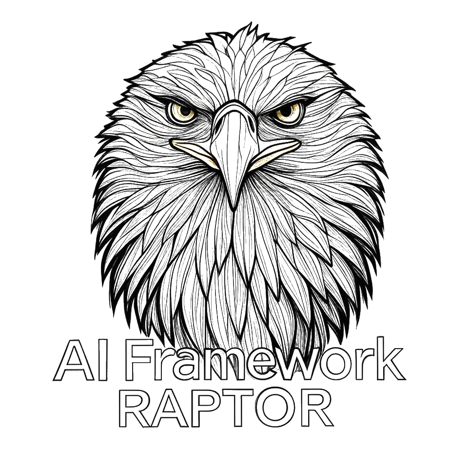

# RAPTOR AI Framework

<p align="center">
  
</p>

<p align="center">
  <strong>Rapid AI-Powered Text and Object Recognition</strong><br>
  Open-Source Content Insight Engine for Enterprise AI Applications
</p>

<p align="center">
  <a href="https://github.com/DHT-AI-Studio/RAPTOR/blob/main/LICENSE">
    
  </a>
  <a href="https://github.com/DHT-AI-Studio/RAPTOR/releases">
    
  </a>
  
  
  <a href="https://github.com/DHT-AI-Studio/RAPTOR/stargazers">
    
  </a>
  <a href="https://github.com/DHT-AI-Studio/RAPTOR/network/members">
    
  </a>
</p>

<p align="center">
  <a href="#-about-raptor">About</a> •
  <a href="#-features">Features</a> •
  <a href="#-installation">Installation</a> •
  <a href="#quick-start">Quick Start</a> •
  <a href="#-documentation">Documentation</a> •
  <a href="#-contributing">Contributing</a> •
  <a href="https://dhtsolution.com/">Website</a>
</p>

---

**RAPTOR** is an advanced AI framework developed by the **DHT Taiwan Team** at [DHT Solutions](https://dhtsolution.com/).

## 🚀 Current Release

**Aigle 0.1** - First Community Beta Release

This is the initial open-source release of the RAPTOR framework, codenamed "Aigle". We're excited to share this with the community and look forward to your feedback and contributions.

### 🧪 Aigle 0.1 - Evaluation and Testing API

To help developers get started with the RAPTOR framework quickly and easily, we've deployed a **test run API** on DHT's development infrastructure. This evaluation API allows developers to:

- **Test and evaluate** RAPTOR capabilities without setting up infrastructure
- **Develop AI applications** using the RAPTOR framework with zero deployment overhead
- **Utilize DHT resources** for testing and development purposes
- **Prototype faster** by accessing pre-configured AI services

This is an excellent way to explore RAPTOR's features, build proof-of-concepts, and validate your use cases before deploying your own infrastructure.

**🔗 Access the Evaluation API:**  
[http://raptor_open_0_1_api.dhtsolution.com:8012/](http://raptor_open_0_1_api.dhtsolution.com:8012/)

For detailed API documentation, usage examples, and access instructions, please visit the link above.

> **Note:** This is a development environment intended for evaluation and testing purposes. For production deployments, please refer to the [Installation](#-installation) and [Development](#development) sections below.

## 📋 Table of Contents

- [About RAPTOR](#about-raptor)
- [Features](#features)
- [Installation](#installation)
- [Quick Start](#quick-start)
- [Documentation](#documentation)
- [Community & Support](#community--support)
- [Contributing](#contributing)
- [License](#license)
- [Acknowledgments](#acknowledgments)

## 🎯 About RAPTOR

**RAPTOR (Rapid AI-Powered Text and Object Recognition)** is a Content Insight Engine that represents a paradigm shift in digital asset management, transforming passive media storage into an intelligent knowledge platform. By leveraging cutting-edge AI technologies including large language models, vector search, and semantic understanding, RAPTOR enables organizations to unlock the full value of their media assets through automated analysis, intelligent search, and actionable insights.

### Business Value Proposition

- **85% reduction** in manual content tagging and metadata generation
- **10x faster** content discovery through semantic search
- **60% improvement** in content reuse and operational efficiency
- **Real-time insights** from video, audio, and document content
- **Enterprise-grade** security, scalability, and integration capabilities

### Strategic Differentiators

1. **AI-Native Architecture**: Built from the ground up around LLM orchestration and vector search
2. **Multi-Modal Understanding**: Unified analysis across video, audio, image, and text
3. **Semantic Intelligence**: Context-aware search that understands intent, not just keywords
4. **Open + Enterprise Model**: Open-source core with premium enterprise features
5. **Production-Ready**: Kubernetes-native with auto-scaling, fault tolerance, and 99.9% uptime

## ✨ Features

### Version Aigle 0.1

This first community release includes:

#### Core Capabilities

- **Multi-Modal Content Analysis**: Process and understand video, audio, images, and text
- **Semantic Search Engine**: Context-aware search using vector embeddings
- **AI-Powered Metadata Generation**: Automated tagging and content classification
- **LLM Orchestration**: Flexible integration with multiple language models
- **Vector Database Integration**: High-performance similarity search and retrieval

#### Intelligence Features

- **Content Understanding**: Extract insights from unstructured media
- **Entity Recognition**: Identify people, places, objects, and concepts
- **Sentiment Analysis**: Understand emotional context in content
- **Topic Modeling**: Automatic categorization and clustering
- **Temporal Analysis**: Track content evolution over time

#### Enterprise Ready

- **Scalable Architecture**: Kubernetes-native deployment
- **API-First Design**: RESTful APIs for seamless integration
- **Security**: Enterprise-grade authentication and authorization
- **Monitoring**: Built-in observability and logging
- **Extensible**: Plugin architecture for custom processors

For detailed release notes, see [CHANGELOG.md](CHANGELOG.md).

## 📦 Installation

```bash
# Clone the repository
git clone https://github.com/DHT-AI-Studio/RAPTOR.git
cd RAPTOR/Aigle/0.1

# Create virtual environment (recommended)
conda create -n CIE python=3.10
conda activate CIE

# Install required dependencies:
pip install -r requirements.txt
```

## Development

### Step 1.

```bash
cd raptor
chmod +x check-services.sh deploy.sh logs.sh rollback.sh stop-all.sh tag-backup.sh
./deploy.sh
```

### Step 2.Deploy service

1. Check container status
   
   ```bash
   ./check-services.sh
   ```

2. Test API connectivity
   
   ```bash
   # Modellifecycle 服務
   curl -s http://192.168.157.165:8086/docs
   
   # Assetmanagement
   curl -s http://192.168.157.165:8010/docs
   ```

3. View service logs
   
   ```bash
   ./logs.sh <service_name>
   ```

## Quick Start

1. Create a new user and assign a new branch to the user
   
   ```bash
   curl -X 'POST' \
   'http://192.168.157.165:8086/users' \
   -H 'accept: application/json' \
   -H 'Content-Type: application/json' \
   -d '{
   "username": "user1",
   "password": "dht888888",
   "password_hash": "",
   "branch": "",
   "permissions": [
       "upload",
       "download",
       "list"
   ]
   }'
   ```

2. Create a new access token for the user
   
   ```bash
   curl -X 'POST' \
   'http://192.168.157.165:8086/token' \
   -H 'accept: application/json' \
   -H 'Content-Type: application/x-www-form-urlencoded' \
   -d 'grant_type=password&username=user1&password=dht888888&scope=&client_id=string&client_secret=********'
   ```

3. Access RedisInsight
   🔗 [http://192.168.157.165:5540](http://192.168.157.165:5540)
   
    Add a new connection:
   
   - Connection Type: **Redis Cluster**
   - Host: `redis1`
   - Port: `7000`
   - Name: `Redis Cluster`
   - Authentication: `dht888888`

4. Check if the local Ollama model includes qwen2.5:7b
   
   ```bash
   ollama list
   ```
   
    If not present
   
   ```bash
   ollama pull qwen2.5:7b
   ```

5. Register MLflow with local Ollama
   
   ```bash
   curl -X 'POST' \
     'http://192.168.157.165:8010/models/register_ollama' \
     -H 'accept: application/json' \
     -H 'Content-Type: application/json' \
     -d '{
     "local_model_name": "qwen2.5:7b",
     "model_params": 7,
     "registered_name": "qwenforsummary",
     "set_priority_to_one": false,
     "stage": "production",
     "task": "text-generation-ollama",
     "version_description": "Register qwen2.5:7b local model"
   }'
   ```

6. Check if the registration was successful
   
   ```bash
   curl -X 'GET' \
     'http://192.168.157.165:8010/models/registered_in_mlflow?show_all=false' \
     -H 'accept: application/json'
   ```

7. Start audio/video/image/document service  
    9.1 Create Kafka topics:
   
   ```bash
   cd path/to/kafka
   chmod +x create_topic.sh
   sudo ./create_topic.sh
   ```
   
    9.2 Starting Services
   
   ```bash
   cd services
   chmod +x start_services.sh
   ./start_services.sh
   ```
   
    9.3 Check if all services are still running
   
   ```bash
   ./check_services.sh
   ```

8. Produce a test requests topic
   
   ```bash
   cd /path/to/kafka/test_service
   python test.py
   ```

9. View Service Logs
   
   ```bash
   cd path/to/kafka
   tail -f service_name.log
   ```
   
    Available service names include: `document_orchestrator_service`, `document_analysis_service`, `document_summary_service`, `document_save2qdrant_service`, etc. You can replace `document` with `audio`, `video`, or `image` based on the required service, for example: `audio_orchestrator_service`, `video_analysis_service`, `image_summary_service`, etc

10. Check Redis Data
    
    ```bash
    sudo docker exec -it redis-kafka_dev redis-cli --raw
    GET "document_orchestrator:correlation_id"
    GET "video_orchestrator:correlation_id"
    GET "audio_orchestrator:correlation_id"
    GET "image_orchestrator:correlation_id"
    ```
    
    Note: Replace service_name and correlation_id with actual values.

11. Use the Qdrant Search API to query data  
    (8821/video_search, 8822/audio_search, 8823/document_search, 8824/image_search)
    
    ```bash
    curl -X POST "http://192.168.157.165:8822/audio_search" \
      -H "Content-Type: application/json" \
      -d '{
        "query_text": "OpenAI",
        "embedding_type": "text",
        "limit": 5
      }'
    ```

## 📚 Documentation

### Available Documentation

- 📖 **[System Design & Architecture](Aigle/0.1/CIE_System_Design_and_Architecture_1.8.pdf)** - High-level system design
- 🔧 **[Technical Implementation Guide](Aigle/0.1/doc/CIE_System_Technical_Implementation_1.2.pdf)** - Detailed implementation
- 📝 **[API Documentation](Aigle/0.1/raptor/)** - API references and examples
- 🚀 **[Quick Start Guide](#quick-start)** - Get started in minutes
- 📋 **[CHANGELOG](MAIN_DOCUMENTATION/CHANGELOG.md)** - Version history and updates

### Additional Resources

- **GitHub Wiki** (Coming soon) - Tutorials, guides, and best practices
- **API Reference** (Coming soon) - Complete API documentation
- **Video Tutorials** (Coming soon) - Step-by-step video guides
- **Examples Repository** (Coming soon) - Sample projects and use cases

## 🛠️ Built With

RAPTOR leverages cutting-edge technologies:

**AI & Machine Learning:**
- 🤖 Large Language Models (LLM) - Multi-provider support
- 🧠 LangChain - LLM orchestration framework
- 🔍 Qdrant - High-performance vector database
- 📊 MLflow - ML lifecycle management
- 🎯 Sentence Transformers - Text embeddings

**Backend & Infrastructure:**
- ⚡ FastAPI - Modern Python web framework
- 🐍 Python 3.8+ - Core programming language
- 🐳 Docker & Docker Compose - Containerization
- ☸️ Kubernetes - Container orchestration (v1.0+)
- 📨 Apache Kafka - Event streaming platform
- 💾 Redis Cluster - High-performance caching

**Processing & Analysis:**
- 🎥 FFmpeg - Video/audio processing
- 🔊 Whisper - Speech recognition
- 🖼️ OpenCV - Computer vision
- 📄 PyPDF2, python-docx - Document processing
- 🎵 Librosa - Audio analysis

**Observability:**
- 📊 Prometheus - Metrics collection
- 📈 Grafana - Metrics visualization
- 🔍 ELK Stack - Logging (roadmap)

## 🌐 Community & Support

<p align="center">
  <a href="https://github.com/DHT-AI-Studio/RAPTOR/issues">
    
  </a>
  <a href="https://github.com/DHT-AI-Studio/RAPTOR/pulls">
    
  </a>
  <a href="https://github.com/DHT-AI-Studio/RAPTOR/graphs/contributors">
    
  </a>
  <a href="https://github.com/DHT-AI-Studio/RAPTOR/commits/main">
    
  </a>
</p>

We value your feedback and encourage community participation!

### 🐛 Reporting Issues & Feature Requests

Please use [GitHub Issues](https://github.com/DHT-AI-Studio/RAPTOR/issues) to:

- 🐛 Report bugs
- ✨ Request new features
- ❓ Ask questions
- 💡 Share suggestions

**Before opening an issue:**
- Check existing issues to avoid duplicates
- Use issue templates when available
- Provide detailed information and steps to reproduce

### 📱 Stay Connected

Join our community on multiple platforms:

<p align="left">
  <a href="https://t.me/dhtsupport">
    
  </a>
  <a href="https://www.instagram.com/DHT.Ai">
    
  </a>
  <a href="https://x.com/dhtsolution2018">
    
  </a>
  <a href="https://dhtsolution.com/">
    
  </a>
</p>

**Follow us for updates, announcements, and community discussions!**

**Coming soon:** Discord server, LinkedIn group, and monthly community calls!

### 💬 Get Help

- 📖 Check our [Documentation](#-documentation) first
- 🔍 Browse [closed issues](https://github.com/DHT-AI-Studio/RAPTOR/issues?q=is%3Aissue+is%3Aclosed) for solutions
- 💭 Start a [Discussion](https://github.com/DHT-AI-Studio/RAPTOR/discussions) for questions
- 📧 Email us through [dhtsolution.com](https://dhtsolution.com/)

We'll post updates, respond to questions, and collaborate with users across these platforms!

## 🤝 Contributing

We welcome contributions from the community! Please read our [CONTRIBUTING.md](/RAPTOR/COMMUNITY_GUIDELINES/CONTRIBUTING.md) guide to get started.

### How to Contribute

1. Fork the repository
2. Create a feature branch (`git checkout -b feature/AmazingFeature`)
3. Commit your changes (`git commit -m 'Add some AmazingFeature'`)
4. Push to the branch (`git push origin feature/AmazingFeature`)
5. Open a Pull Request

Please read our [Code of Conduct](/COMMUNITY_GUIDELINES/CODE_OF_CONDUCT.md) before contributing.

## 📄 License

This project is licensed under the Apache License 2.0 - see the [LICENSE](LICENSE) file for details.

```
Copyright 2025 DHT Taiwan Team

Licensed under the Apache License, Version 2.0 (the "License");
you may not use this file except in compliance with the License.
You may obtain a copy of the License at

    http://www.apache.org/licenses/LICENSE-2.0

Unless required by applicable law or agreed to in writing, software
distributed under the License is distributed on an "AS IS" BASIS,
WITHOUT WARRANTIES OR CONDITIONS OF ANY KIND, either express or implied.
See the License for the specific language governing permissions and
limitations under the License.
```

## 🙏 Acknowledgments

RAPTOR is developed and maintained by the **DHT Taiwan Team**.

**About DHT Solutions**

DHT Solutions is a technology company specializing in AI and software development solutions. Learn more at [https://dhtsolution.com/](https://dhtsolution.com/).

## 👥 Development Team

Meet the talented developers behind RAPTOR:

<table>
  <tr>
    <td align="center">
      <a href="https://github.com/titanh">
        <br />
        <sub><b>titanh</b></sub>
      </a>
    </td>
    <td align="center">
      <a href="https://github.com/Cing-dht">
        <br />
        <sub><b>Cing-dht</b></sub>
      </a>
    </td>
    <td align="center">
      <a href="https://github.com/fungdht">
        <br />
        <sub><b>fungdht</b></sub>
      </a>
    </td>
    <td align="center">
      <a href="https://github.com/GeorgeDHT">
        <br />
        <sub><b>GeorgeDHT</b></sub>
      </a>
    </td>
    <td align="center">
      <a href="https://github.com/NelsonYou1026">
        <br />
        <sub><b>NelsonYou1026</b></sub>
      </a>
    </td>
  </tr>
  <tr>
    <td align="center">
      <a href="https://github.com/tianyu0223">
        <br />
        <sub><b>tianyu0223</b></sub>
      </a>
    </td>
    <td align="center">
      <a href="https://github.com/Robertdht">
        <br />
        <sub><b>Robertdht</b></sub>
      </a>
    </td>
    <td align="center">
      <a href="https://github.com/QuinnChueh">
        <br />
        <sub><b>QuinnChueh</b></sub>
      </a>
    </td>
    <td align="center">
      <a href="https://github.com/Matthew20040407">
        <br />
        <sub><b>Matthew20040407</b></sub>
      </a>
    </td>
    <td align="center">
      <a href="https://github.com/minnie-dhtsolution">
        <br />
        <sub><b>minnie-dhtsolution</b></sub>
      </a>
    </td>
  </tr>
  <tr>
    <td align="center">
      <a href="https://github.com/lunar8386">
        <br />
        <sub><b>lunar8386</b></sub>
      </a>
    </td>
    <td align="center">
      <a href="https://github.com/Joe-DHT">
        <br />
        <sub><b>Joe-DHT</b></sub>
      </a>
    </td>
    <td align="center">
      <a href="https://github.com/benjamin-dhtsolution">
        <br />
        <sub><b>benjamin-dhtsolution</b></sub>
      </a>
    </td>
  </tr>
</table>

## 🗺️ Future Development Roadmap

The following features are planned for upcoming releases to transform RAPTOR into a production-ready, enterprise-grade platform:

### **1. API Gateway & Integration (v0.2 - Q4 2025)**

- **API Gateway**: Production-ready gateway with rate limiting and API documentation portal
- **Webhook System**: Event-driven integration capability with webhook event system

### **2. Advanced Video Understanding (v0.3 - Q4 2025)**

- Implement temporal reasoning models for event sequences
- Add action recognition and activity detection
- Build scene relationship graphs
- Create timeline-based navigation interface
- *Note: Docker Compose deployment won't scale to production needs*

### **3. AI LLM Interface - MCP Integration (v0.3 - Q4 2025)**

Implement **Model Context Protocol (MCP)** interfaces for core services:

- Document Processing
- Video Analysis
- Audio Processing
- Image Analysis
- Semantic Search
- Vector Database queries
- Model Management
- MCP Prompts

### **4. Custom Model Training Pipeline (v0.4 - Q1 2026)**

- Build fine-tuning workflows for domain-specific models
- **Optimized Training**: Automated pipelines with DeepSpeed optimization, model evaluation framework, customer data isolation
- **Federated Learning**: Privacy-preserving distributed training where data stays local, only model updates transferred

### **5. Admin Dashboard (v0.4 - Q1 2026)**

- Integrate Prometheus/Grafana metrics for real-time monitoring console
- Create user management UI with role-based access control
- Permission management and audit logging

### **6. OAuth2/OpenID Connect Integration (v0.4 - Q1 2026)**

- Migrate from basic JWT to OAuth2/OIDC standards
- Enterprise SSO support (Azure AD, Google Workspace, Okta)
- Multi-factor authentication

### **7. Content Moderation & Compliance (v0.5 - Q1 2026)**

- Train content moderation models (NSFW, violence, hate speech)
- Implement automated flagging system
- Build GDPR/CCPA compliance workflows
- Create comprehensive audit reporting

### **8. Kubernetes Production Deployment (v1.0 - March 2026)**

- Production-ready Kubernetes deployment with Helm charts
- Automated horizontal and vertical scaling
- Service mesh integration for resilience
- Multi-environment support (dev/staging/prod)
- *Critical: Docker Compose is not suitable for production scale*

### **9. Centralized Logging & Observability (v1.0 - March 2026)**

- Deploy ELK Stack (Elasticsearch, Logstash, Kibana)
- Configure log shipping from all 25+ services
- Centralized log aggregation and retention
- Advanced log search and analytics
- Distributed tracing integration

### Release Timeline

| Version  | Target     | Focus               | Key Features                               |
| -------- | ---------- | ------------------- | ------------------------------------------ |
| **v0.2** | Q4 2025    | API & Integration   | API Gateway, Webhooks                      |
| **v0.3** | Q4 2025    | AI Enhancement      | Video Understanding, MCP Interface         |
| **v0.4** | Q1 2026    | Enterprise Features | Training Pipeline, Admin Dashboard, OAuth2 |
| **v0.5** | Q1 2026    | Compliance          | Content Moderation, GDPR/CCPA              |
| **v1.0** | March 2026 | Production Ready    | Kubernetes, ELK Stack, 99.9% SLA           |

**Current Status**: Aigle 0.1 (Community Beta) - October 2025 ✅  
**Next Milestone**: v0.2 with API Gateway (Q4 2025)  
**Production Target**: v1.0 by March 2026

---

**Made with ❤️ by the DHT Taiwan Team**

For business inquiries: [https://dhtsolution.com/](https://dhtsolution.com/)
