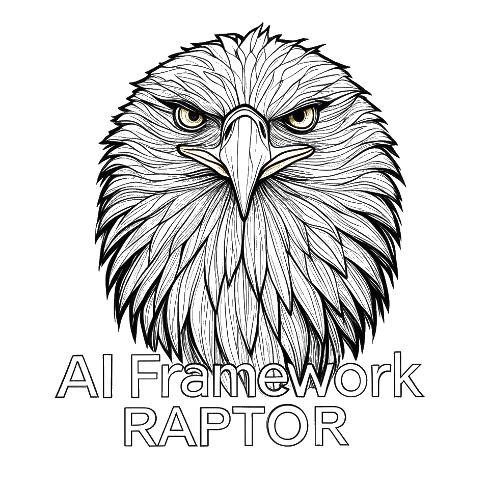

# RAPTOR AI Framework

<p align="center">
  
</p>

<p align="center">
  <strong>Robust AI-Powered Toolkit for Operational Robots</strong><br>
  Open-Source Content Insight Engine for Enterprise AI Applications
</p>

<p align="center">
  <a href="https://github.com/DHT-AI-Studio/RAPTOR/blob/main/LICENSE">
    
  </a>
  <a href="https://github.com/DHT-AI-Studio/RAPTOR/releases">
    
  </a>
  
  
  <a href="https://github.com/DHT-AI-Studio/RAPTOR/stargazers">
    
  </a>
  <a href="https://github.com/DHT-AI-Studio/RAPTOR/network/members">
    
  </a>
</p>

<p align="center">
  <a href="#-about-raptor">About</a> •
  <a href="#-features">Features</a> •
  <a href="#-installation">Installation</a> •
  <a href="#quick-start">Quick Start</a> •
  <a href="#-documentation">Documentation</a> •
  <a href="#-contributing">Contributing</a> •
  <a href="https://dhtsolution.com/">Website</a>
</p>

---

**RAPTOR** is an advanced AI framework developed by the **DHT Taiwan Team** at [DHT Solutions](https://dhtsolution.com/).

## 🚀 Current Release

**Aigle 0.4** - Community Beta (August 2026)

This release continues the open-source RAPTOR framework, codenamed "Aigle". Release 0.4 grows the platform to **27 independently deployable Docker Compose modules** (three earlier modules — hybrid-search, graph-database, graph-service — are retired and kept only for rollback) driven by the same single build system (`Aigle/0.4/deployment/modules/build.py`), and delivers the v0.4 roadmap: MCP interfaces across core services, persistent multimodal memory, and a per-user isolated multi-model database that replaces the previous Qdrant/OpenSearch/Neo4j trio.

**Highlights:**

- 🔌 **MCP Server** — Raptor's search, RAG, asset, and memory APIs exposed as Model Context Protocol tools/resources for LLM clients (module 27)
- 🧠 **Memory Service** — persistent per-user/per-session memory (facts, preferences, conversation history, multimedia) backed by MemVID, layered underneath the existing Redis short-term chat cache (module 26)
- 🗄️ **Personal DB Service** — one physically isolated ArcadeDB database per user, replacing the old per-user Qdrant + OpenSearch + Neo4j trio with unified hybrid BM25 + vector + graph + temporal-fact search (modules 24/25)
- 🛡️ **Guardrail Service** — LLM input/output content moderation with pluggable guard models (Llama Guard 3 / Granite Guardian / GPT-OSS-Safeguard) and a policy engine; ships disabled by default (module 23)
- 📊 **Benchmark Service** — user-defined scoring schemas (keyword match, LLM-as-judge, cosine similarity) to regression-test chat/RAG/search/classification pipelines (module 22)
- 🎬 **Video Search 2.0, GraphRAG, A2A, branch isolation** — carried over from Aigle 0.3 (see [Features](#-features) below)

See [`Aigle/0.4/README.md`](Aigle/0.4/README.md) for the module reference, [`Aigle/0.4/BUILD.md`](Aigle/0.4/BUILD.md) for the build guide, [`Aigle/0.4/API_REFERENCE.md`](Aigle/0.4/API_REFERENCE.md) for the API reference, and [`Aigle/0.4/MCP_REFERENCE.md`](Aigle/0.4/MCP_REFERENCE.md) for the new MCP reference.

### 🧪 Evaluation and Testing API (Aigle 0.4)

To help developers get started with the RAPTOR framework quickly and easily, we've deployed a **test run API** on DHT's development infrastructure. This evaluation API allows developers to:

- **Test and evaluate** RAPTOR capabilities without setting up infrastructure
- **Develop AI applications** using the RAPTOR framework with zero deployment overhead
- **Utilize DHT resources** for testing and development purposes
- **Prototype faster** by accessing pre-configured AI services

This is an excellent way to explore RAPTOR's features, build proof-of-concepts, and validate your use cases before deploying your own infrastructure.

**🔗 Access the Evaluation API:**  
[http://raptor_open_0_4_api.dhtsolution.com:8012/](http://raptor_open_0_4_api.dhtsolution.com:8012/)

For detailed API documentation, usage examples, and access instructions, see [`Aigle/0.4/API_REFERENCE.md`](Aigle/0.4/API_REFERENCE.md) or visit the link above.

> **Note:** This is a development environment intended for evaluation and testing purposes. For production deployments, please refer to the [Installation](#-installation) and [Development](#development) sections below.

## 📋 Table of Contents

- [About RAPTOR](#about-raptor)
- [Features](#features)
- [Installation](#installation)
- [Quick Start](#quick-start)
- [Documentation](#documentation)
- [Community & Support](#community--support)
- [Contributing](#contributing)
- [License](#license)
- [Acknowledgments](#acknowledgments)

## 🎯 About RAPTOR

**RAPTOR (Robust AI-Powered Toolkit for Operational Robots)** is a Content Insight Engine that represents a paradigm shift in digital asset management, transforming passive media storage into an intelligent knowledge platform. By leveraging cutting-edge AI technologies including large language models, vector search, and semantic understanding, RAPTOR enables organizations to unlock the full value of their media assets through automated analysis, intelligent search, and actionable insights.

### Business Value Proposition

- **85% reduction** in manual content tagging and metadata generation
- **10x faster** content discovery through semantic search
- **60% improvement** in content reuse and operational efficiency
- **Real-time insights** from video, audio, and document content
- **Enterprise-grade** security, scalability, and integration capabilities

### Strategic Differentiators

1. **AI-Native Architecture**: Built from the ground up around LLM orchestration and vector search
2. **Multi-Modal Understanding**: Unified analysis across video, audio, image, and text
3. **Semantic Intelligence**: Context-aware search that understands intent, not just keywords
4. **Open + Enterprise Model**: Open-source core with premium enterprise features
5. **Production-Ready**: Kubernetes-native with auto-scaling, fault tolerance, and 99.9% uptime

## ✨ Features

### Version Aigle 0.4

New in this release:

- **MCP Interfaces**: Model Context Protocol tools/resources over search, RAG, asset, and memory APIs, plus MCP Prompts (module 27)
- **Memory Service**: persistent per-user/per-session facts, preferences, conversation history, and multimedia memory on MemVID, with hybrid semantic + BM25 retrieval, layered under the existing Redis short-term chat cache (module 26)
- **Personal DB Service**: one physically isolated ArcadeDB database per user — unified vector, BM25, and graph storage replacing the old per-user Qdrant + OpenSearch + Neo4j trio (modules 24/25)
- **Guardrail Service**: LLM input/output safety checks (Llama Guard 3 / Granite Guardian / GPT-OSS-Safeguard) with a policy engine and violation audit logging; ships disabled by default (module 23)
- **Benchmark Service**: schema-driven scoring (keyword match, exact/regex match, cosine similarity, LLM-as-judge) with run history and pairwise comparison (module 22)

Carried over from Aigle 0.3:

- **Modular Deployment System**: one build entry point (`build.py`) — start, stop, rebuild, or inspect any subset of the platform
- **Hybrid Search & GraphRAG**: now served per-user through Module 25's ArcadeDB index (BM25 + vector + graph + temporal facts), replacing the original OpenSearch/Qdrant/Neo4j-backed implementation
- **A2A Agent Orchestration**: JSON-RPC agent-to-agent discovery and multi-agent RAG pipelines
- **Video-centric Search API**: results aggregated per video with the most relevant time segments
- **Branch-based Multi-tenancy**: full `branch_id` isolation across upload, processing, indexing, and retrieval
- **Demo Web Frontend**: React + Vite UI for upload, video search, and history management

Carried over from Aigle 0.2:

#### Core Capabilities

- **Multi-Modal Content Analysis**: Process and understand video, audio, images, and text
- **Semantic Search Engine**: Context-aware search using vector embeddings
- **AI-Powered Metadata Generation**: Automated tagging and content classification
- **LLM Orchestration**: Flexible integration with multiple language models
- **Vector Database Integration**: High-performance similarity search and retrieval
- **Model fine-tuning & training**: Fine-tuning workflows, training pipelines, and evaluation for domain-specific models

#### Intelligence Features

- **Content Understanding**: Extract insights from unstructured media
- **Entity Recognition**: Identify people, places, objects, and concepts
- **Sentiment Analysis**: Understand emotional context in content
- **Topic Modeling**: Automatic categorization and clustering
- **Temporal Analysis**: Track content evolution over time

#### Enterprise Ready

- **Scalable Architecture**: Kubernetes-native deployment
- **API-First Design**: RESTful APIs for seamless integration
- **Security**: Enterprise-grade authentication and authorization
- **Monitoring**: Built-in observability and logging
- **Extensible**: Plugin architecture for custom processors

For detailed release notes, see [CHANGELOG.md](CHANGELOG.md).

## 📦 Installation

**Prerequisites** (full details, host sizing, and port matrix: [`Aigle/0.4/BUILD.md`](Aigle/0.4/BUILD.md) §1):

- **Software**: Docker Engine 24.0+, Docker Compose v2.20+, Python 3.10+, NVIDIA Container Toolkit on GPU hosts
- **GPU**: NVIDIA driver supporting CUDA 12.8+ (media stack targets sm_120 / Blackwell); 24 GB+ VRAM, 36 GB+ recommended for video processing (InternVL)
- **Inference servers**: an **Ollama** server (port 11434) reachable from the cluster — it may be an existing external server; optionally a **vLLM** OpenAI-compatible server as an alternative LLM backend (vLLM is not bundled)
- **Storage**: an NFSv4 export (module 01 provides a containerized NFS server, or use a native one) mounted by object-storage, AI-ML services, and media workers
- **Network**: all hosts routable with static IPs, synchronized clocks, and firewall openings per the BUILD.md port matrix; single-host evaluation and multi-host production topologies are both supported

```bash
# Clone the repository
git clone https://github.com/DHT-AI-Studio/RAPTOR.git
cd RAPTOR/Aigle/0.4

# Configure: copy the templates and fill in hosts, credentials, and model names
cd deployment/modules
cp .env.example .env
for m in */; do [ -f "$m/.env.example" ] && cp "$m/.env.example" "$m/.env"; done
cd ../..
```

See [`Aigle/0.4/BUILD.md`](Aigle/0.4/BUILD.md) for the full configuration reference.

## Development

```bash
cd Aigle/0.4

# Build the shared GPU base image first (used by modules 09-12)
bash deploy.sh -m 08 --build

# Start all modules in dependency order (or --cpu-only to skip GPU modules)
bash deploy.sh

# Inspect
bash deploy.sh --status              # running / stopped status per module
bash deploy.sh -m <id> --logs        # follow a module's logs
```

## Quick Start

1. Deploy the platform (see [Development](#development) above), then open the API Gateway docs:

   ```bash
   curl -s http://<host_ip>:8012/docs
   ```

2. Log in through SSO to obtain a token (users/groups are managed by the authentication module, Keycloak-backed):

   ```bash
   curl -X POST "http://<host_ip>:8012/api/0.4/sso/login" \
     -H "Content-Type: application/json" \
     -d '{"username": "<user>", "password": "<password>"}'
   ```

3. Upload a media file for automatic AI processing (transcription, OCR, frame description, summary, embeddings, knowledge graph):

   ```bash
   curl -X POST "http://<host_ip>:8012/api/0.4/asset/fileupload_analysis" \
     -H "Authorization: Bearer <token>" \
     -F "file=@/path/to/video.mp4"
   ```

4. Search — video-centric, multi-recall (BM25 + Vector + GraphRAG + TKG) with cross-encoder re-ranking:

   ```bash
   curl -X POST "http://<host_ip>:8012/api/0.4/search/video_search" \
     -H "Authorization: Bearer <token>" \
     -H "Content-Type: application/json" \
     -d '{"query": "OpenAI announcement", "top_k": 5}'
   ```

5. Ask questions over your content with RAG chat:

   ```bash
   curl -X POST "http://<host_ip>:8012/api/0.4/chat/chat" \
     -H "Authorization: Bearer <token>" \
     -H "Content-Type: application/json" \
     -d '{"message": "Summarize the uploaded video"}'
   ```

Or use the **demo frontend** instead of raw APIs:

```bash
cd Aigle/0.4/raptor-demo-frontend
cp .env.example .env        # set API_TARGET / DEMO_PORT
docker compose up -d --build
```

For the complete endpoint list, request/response schemas, and Python client examples, see [`Aigle/0.4/API_REFERENCE.md`](Aigle/0.4/API_REFERENCE.md) and [`Aigle/0.4/raptor_client.py`](Aigle/0.4/raptor_client.py).

## 📚 Documentation

### Available Documentation

- 🧩 **[Module Reference (0.4)](Aigle/0.4/README.md)** - 27-module architecture, deprecated/in-development modules, service ports
- 🛠️ **[Setup, Build & Configuration Guide (0.4)](Aigle/0.4/BUILD.md)** - Prerequisites, .env configuration, single/multi-host deployment, source maintenance
- 📝 **[API Reference (0.4)](Aigle/0.4/API_REFERENCE.md)** - Complete endpoint documentation with examples
- 🔌 **[MCP Reference (0.4)](Aigle/0.4/MCP_REFERENCE.md)** - Model Context Protocol tool catalog and client-authentication guide
- 🚀 **[Quick Start Guide](#quick-start)** - Get started in minutes
- 📖 **[System Design & Architecture](Aigle/0.1/CIE_System_Design_and_Architecture_1.8.pdf)** - High-level system design
- 🔧 **[Technical Implementation Guide](Aigle/0.1/doc/CIE_System_Technical_Implementation_1.2.pdf)** - Detailed implementation
- 📋 **[CHANGELOG](MAIN_DOCUMENTATION/CHANGELOG.md)** - Version history and updates

### Additional Resources

- **GitHub Wiki** (Coming soon) - Tutorials, guides, and best practices
- **API Reference** (Coming soon) - Complete API documentation
- **Video Tutorials** (Coming soon) - Step-by-step video guides
- **Examples Repository** (Coming soon) - Sample projects and use cases

## 🛠️ Built With

RAPTOR leverages cutting-edge technologies:

**AI & Machine Learning:**
- 🤖 Large Language Models (LLM) - Multi-provider support
- 🧠 LangChain - LLM orchestration framework
- 🔍 Qdrant - High-performance vector database
- 📊 MLflow - ML lifecycle management
- 🎯 Sentence Transformers - Text embeddings

**Backend & Infrastructure:**
- ⚡ FastAPI - Modern Python web framework
- 🐍 Python 3.8+ - Core programming language
- 🐳 Docker & Docker Compose - Containerization
- ☸️ Kubernetes - Container orchestration (v1.0+)
- 📨 Apache Kafka - Event streaming platform
- 💾 Redis Cluster - High-performance caching

**Processing & Analysis:**
- 🎥 FFmpeg - Video/audio processing
- 🔊 Whisper - Speech recognition
- 🖼️ OpenCV - Computer vision
- 📄 PyPDF2, python-docx - Document processing
- 🎵 Librosa - Audio analysis

**Observability:**
- 📊 Prometheus - Metrics collection
- 📈 Grafana - Metrics visualization
- 🔍 ELK Stack - Logging (roadmap)

## 🌐 Community & Support

<p align="center">
  <a href="https://github.com/DHT-AI-Studio/RAPTOR/issues">
    
  </a>
  <a href="https://github.com/DHT-AI-Studio/RAPTOR/pulls">
    
  </a>
  <a href="https://github.com/DHT-AI-Studio/RAPTOR/graphs/contributors">
    
  </a>
  <a href="https://github.com/DHT-AI-Studio/RAPTOR/commits/main">
    
  </a>
</p>

We value your feedback and encourage community participation!

### 🐛 Reporting Issues & Feature Requests

Please use [GitHub Issues](https://github.com/DHT-AI-Studio/RAPTOR/issues) to:

- 🐛 Report bugs
- ✨ Request new features
- ❓ Ask questions
- 💡 Share suggestions

**Before opening an issue:**
- Check existing issues to avoid duplicates
- Use issue templates when available
- Provide detailed information and steps to reproduce

### 📱 Stay Connected

Join our community on multiple platforms:

<p align="left">
  <a href="https://t.me/dhtsupport">
    
  </a>
  <a href="https://www.instagram.com/DHT.Ai">
    
  </a>
  <a href="https://x.com/dhtsolution2018">
    
  </a>
  <a href="https://dhtsolution.com/">
    
  </a>
</p>

**Follow us for updates, announcements, and community discussions!**

**Coming soon:** Discord server, LinkedIn group, and monthly community calls!

### 💬 Get Help

- 📖 Check our [Documentation](#-documentation) first
- 🔍 Browse [closed issues](https://github.com/DHT-AI-Studio/RAPTOR/issues?q=is%3Aissue+is%3Aclosed) for solutions
- 💭 Start a [Discussion](https://github.com/DHT-AI-Studio/RAPTOR/discussions) for questions
- 📧 Email us through [dhtsolution.com](https://dhtsolution.com/)

We'll post updates, respond to questions, and collaborate with users across these platforms!

## 🤝 Contributing

We welcome contributions from the community! Please read our [CONTRIBUTING.md](/RAPTOR/COMMUNITY_GUIDELINES/CONTRIBUTING.md) guide to get started.

### How to Contribute

1. Fork the repository
2. Create a feature branch (`git checkout -b feature/AmazingFeature`)
3. Commit your changes (`git commit -m 'Add some AmazingFeature'`)
4. Push to the branch (`git push origin feature/AmazingFeature`)
5. Open a Pull Request

Please read our [Code of Conduct](/COMMUNITY_GUIDELINES/CODE_OF_CONDUCT.md) before contributing.

## 📄 License

This project is licensed under the Apache License 2.0 - see the [LICENSE](LICENSE) file for details.

```
Copyright 2025 DHT Taiwan Team

Licensed under the Apache License, Version 2.0 (the "License");
you may not use this file except in compliance with the License.
You may obtain a copy of the License at

    http://www.apache.org/licenses/LICENSE-2.0

Unless required by applicable law or agreed to in writing, software
distributed under the License is distributed on an "AS IS" BASIS,
WITHOUT WARRANTIES OR CONDITIONS OF ANY KIND, either express or implied.
See the License for the specific language governing permissions and
limitations under the License.
```

## 🙏 Acknowledgments

RAPTOR is developed and maintained by the **DHT Taiwan Team**.

**About DHT Solutions**

DHT Solutions is a technology company specializing in AI and software development solutions. Learn more at [https://dhtsolution.com/](https://dhtsolution.com/).

## 👥 Development Team

Meet the talented developers behind RAPTOR:

<table>
  <tr>
    <td align="center">
      <a href="https://github.com/titanh">
        <br />
        <sub><b>titanh</b></sub>
      </a>
    </td>
    <td align="center">
      <a href="https://github.com/Cing-dht">
        <br />
        <sub><b>Cing-dht</b></sub>
      </a>
    </td>
    <td align="center">
      <a href="https://github.com/fungdht">
        <br />
        <sub><b>fungdht</b></sub>
      </a>
    </td>
    <td align="center">
      <a href="https://github.com/GeorgeDHT">
        <br />
        <sub><b>GeorgeDHT</b></sub>
      </a>
    </td>
    <td align="center">
      <a href="https://github.com/NelsonYou1026">
        <br />
        <sub><b>NelsonYou1026</b></sub>
      </a>
    </td>
  </tr>
  <tr>
    <td align="center">
      <a href="https://github.com/tianyu0223">
        <br />
        <sub><b>tianyu0223</b></sub>
      </a>
    </td>
    <td align="center">
      <a href="https://github.com/Robertdht">
        <br />
        <sub><b>Robertdht</b></sub>
      </a>
    </td>
    <td align="center">
      <a href="https://github.com/QuinnChueh">
        <br />
        <sub><b>QuinnChueh</b></sub>
      </a>
    </td>
    <td align="center">
      <a href="https://github.com/Matthew20040407">
        <br />
        <sub><b>Matthew20040407</b></sub>
      </a>
    </td>
    <td align="center">
      <a href="https://github.com/minnie-dhtsolution">
        <br />
        <sub><b>minnie-dhtsolution</b></sub>
      </a>
    </td>
  </tr>
  <tr>
    <td align="center">
      <a href="https://github.com/lunar8386">
        <br />
        <sub><b>lunar8386</b></sub>
      </a>
    </td>
    <td align="center">
      <a href="https://github.com/Joe-DHT">
        <br />
        <sub><b>Joe-DHT</b></sub>
      </a>
    </td>
    <td align="center">
      <a href="https://github.com/benjamin-dhtsolution">
        <br />
        <sub><b>benjamin-dhtsolution</b></sub>
      </a>
    </td>
  </tr>
</table>

## 🗺️ Future Development Roadmap

The following features are planned for upcoming releases to transform RAPTOR into a production-ready, enterprise-grade platform:

### **1. Advanced Video Understanding (v0.3 — ✅ delivered)**

- Implement temporal reasoning models for event sequences
- Add action recognition and activity detection
- Build scene relationship graphs
- Create timeline-based navigation interface
- *Note: Docker Compose deployment won't scale to production needs*

### **2. Content Moderation & Compliance (v0.5)**

- Train content moderation models (NSFW, violence, hate speech)
- Implement automated flagging system
- Build GDPR/CCPA compliance workflows
- Create comprehensive audit reporting

### **3. Graph database & GraphRAG (v0.3 — ✅ delivered)**

- Graph-native storage and retrieval augmented generation on graph structure

### **4. Agents & interoperability (v0.3 — ✅ delivered)**

- Multi-agent workflows, agent-to-agent coordination, **JSON-RPC** communication, and self-learning / self-tuning agent behavior

### **5. Temporal model & temporal knowledge graph (v0.3 — ✅ delivered)**

- Time-aware models and knowledge graphs for evolving facts and sequences

### **6. BM25 RAG & BM25 search (v0.3 — ✅ delivered)**

- Hybrid and keyword-first retrieval with BM25 alongside semantic RAG

### **7. Contextual embedding (v0.3 — ✅ delivered)**

- Embeddings that preserve richer context for retrieval and downstream reasoning

### **8. AI LLM Interface - MCP Integration (v0.4 — ✅ delivered)**

Implement **Model Context Protocol (MCP)** interfaces for core services:

- Document Processing
- Video Analysis
- Audio Processing
- Image Analysis
- Semantic Search
- Vector Database queries
- Model Management
- MCP Prompts

### **9. Memory Services (v0.4 — ✅ delivered)**

- **Persistent memory**: Stores complete per-user and per-session histories beyond Redis limits
- **Two-tier architecture**: Uses Redis for speed and MemVID for durable storage
- **Semantic retrieval**: Combines BM25, vector search, timelines, and context merging
- **Multimodal memory**: Indexes video, audio, images, and documents using searchable embeddings
- **Service APIs**: Support memory CRUD, search, export, statistics, and secure deletion
- **Application integration**: Enables cross-session continuity, preference recall, entity tracking, and knowledge reuse

### **10. Personal Database Service (v0.4 — ✅ delivered)**

- ArcadeDB replaces Neo4j, Qdrant, and OpenSearch, providing unified multi-model storage and efficient retrieval
- Physically isolated per-user databases guarantee independent data privacy, seamless backups, exports, and deletions
- ArcadeDB manages lifecycles securely through gateway authentication
- Kafka asynchronously routes worker outputs into user-specific ArcadeDB databases through dedicated event topics
- Redis actively prevents duplicate indexing while Module 07 generates necessary embeddings for records
- Unified native SQL efficiently combines vector similarity, BM25 text, and complex graph traversals
- The platform natively supports comprehensive temporal knowledge graphs and advanced GraphRAG query execution

### **11. Real-time audio processing (v0.5)**

- Low-latency audio ingestion, analysis, and pipeline integration

### **12. Guardrail Service (v0.4 — ✅ delivered)**

- Guardrail (module 23) sits in front of LLM inference, ready to check inputs/outputs against configurable safety policies
- Ships with pluggable guard-model classification (Llama Guard 3 / Granite Guardian / GPT-OSS-Safeguard) plus a separate regex/detector-based policy engine and LLM-judged policy checks
- Administrators can define, upload, and activate custom safety policies stored securely within PostgreSQL, with violation audit logging
- Redis-backed toggles let administrators enable/disable the whole system, or individual policies, without redeployment
- **Disabled by default**: today's production traffic (Modules 07/13) only exercises the policy-free guard-model check — no policy has been activated yet

### **13. gRPC API Interface (v0.5)**

- New gRPC interface optimizing backend communication and media streaming operations
- A strictly versioned protobuf contract natively handles search, asset transfers, job tracking, and analysis
- StreamVideoSegment dynamically transcodes media into fragmented MP4 formats for immediate client playback capabilities
- The abstract client transparently switches between traditional REST and new gRPC transports using configurations
- Browser clients receive seamless WebSocket job progress updates relayed directly from backend gRPC streams
- Advanced gRPC interceptors enforce authentication, propagate backpressure, and guarantee constant memory during large transfers

### **14. Kubernetes Production Deployment (v1.0)**

- Production-ready Kubernetes deployment with Helm charts
- Automated horizontal and vertical scaling
- Service mesh integration for resilience
- Multi-environment support (dev/staging/prod)
- *Critical: Docker Compose is not suitable for production scale*

### **15. Centralized Logging & Observability (v1.0)**

- Deploy ELK Stack (Elasticsearch, Logstash, Kibana)
- Configure log shipping from all 30+ services
- Centralized log aggregation and retention
- Advanced log search and analytics
- Distributed tracing integration

### Release Timeline

| Version    | Target    | Focus                       | Key Features                                                                            |
| ---------- | --------- | --------------------------- | --------------------------------------------------------------------------------------- |
| **v0.3**   | June 2026 ✅ | AI enhancement & retrieval  | Advanced video, Graph DB & GraphRAG, Agents/JSON-RPC, temporal KG, BM25, contextual embeddings — **Delivered** |
| **v0.4**   | Aug 2026 ✅ | LLM interoperability & memory | MCP integration across core services, persistent session-based multimodal memory, per-user isolated multi-model databases with hybrid/graph/temporal search, Guardrail content moderation, Benchmark scoring service — **Delivered** |
| **v0.5**   | Sep 2026  | Interfaces, media & compliance | gRPC API interface, content moderation, Guardrail services integration, GDPR/CCPA, real-time audio processing |
| **v1.0**   | Q4 2026   | Production ready            | Kubernetes, ELK Stack, 99.9% SLA                                                       |

**Current Status**: Aigle 0.4 (Community Beta) - August 2026 ✅  
**Next Milestone**: v0.5 (Sep 2026)  
**Production Target**: v1.0 in Q4 2026

---

**Made with ❤️ by the DHT Taiwan Team**

For business inquiries: [https://dhtsolution.com/](https://dhtsolution.com/)
